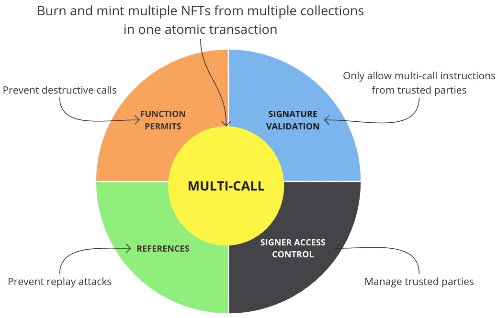

## Background
---
Currently the Primary Sales product uses the pattern of Multicall to transfer ERC20 tokens and mint ERC721/ERC1155 tokens in a single transaction. The Multicaller contract is a common pattern in the space and is used by many projects, this has some added security features that will be mentioned below.

## Architecture
---
### Contract High-Level Design
---


The core of the `Guarded Multi-caller` system is `Multi-call`, allowing for the minting and burning of multiple NFTs from various collections in a single transaction. Due to the high level of security needed when working with NFTs, additional safety measures have been implemented to meet security standards.

- `Function Permits` prevent destructive calls from being made from the Multi-caller contract.
- `Signature Validation` prevents multi-call instructions from random parties and only allows multi-call instructions from trusted parties.
- `Signer Access Control` manages these trusted parties.
- `References` provide anti-replay protection and help sync with any web2 system listening to events.

### System High-Level Design
---

#### Components
---
| Component                    	| Ownership 	| Description                                                                                                             	|
|------------------------------	|-----------	|-------------------------------------------------------------------------------------------------------------------------	|
| Client                       	| Customer  	| This can be a game client or a mobile client that the players interact with.                                            	|
| Central Authority            	| Customer  	| It generates a list of function calls to be executed and gets a valid signature for those calls from `Multi-call Signer`. 	|
| Multi-call Signer            	| Customer 	  |  It takes a list of function calls and generates a valid signature using a `EOA` with `MULTICALL_SIGNER_ROLE`.              	|
| Guarded Multicaller Contract 	| Customer  	| It validates an input signature and executes an authorized list of function calls.                                      	|

#### Flow
---
Let’s look at the flow for basic crafting, where players burn one NFT from the `ERC721Card` contract and mint a new NFT on the `ERC721Pet` contract:

1. An `EOA` with `DEFAULT_ADMIN_ROLE` calls the `Guarded Multi-caller` contract to permit mint function `mint(address,uint256)` with the `ERC721Pet` contract.
2. An `EOA` with `DEFAULT_ADMIN_ROLE` calls the `ERC721Pet` contract to grant `MINTER_ROLE` to the `Guarded Multi-caller` contract.
3. A client requests the `Central Authority` to generate a list of function calls to burn and mint and request a signature from the `Multi-call Signer`.
4. The `Multi-call Signer` uses an account with `MULTICALL_SIGNER_ROLE` to sign the function calls and returns the signature back to the `Central Authority`. 
5. The `Central Authority` returns the list of function calls and the signature to the client.
6. The `Client` approves the `Guarded Multi-caller` contract as a spender for their `ERC721Card` NFT.
7. The `Client` submits a transaction to the `Guarded Multi-caller` contract to execute the list of function calls.
8. The `GuardedMulticaller` contract calls the `ERC721Card` contract to burn the NFT and calls the `ERC721Pet` contract to mint a new NFT to the player’s wallet.

## Public Interface
---
```javascript
function execute(
    address _multicallSigner,
    bytes32 _ref,
    address[] calldata _targets,
    bytes[] calldata _data,
    uint256 _deadline,
    bytes calldata _signature
)

function setFunctionPermits(
    address[] calldata _targets,
    bytes4[] calldata _functionSelectors,
    bool[] calldata _permitted
)

function isFunctionPermitted(
    address _target,
    bytes4 _functionSelector
)

function grantMulticallSignerRole(
    address _user
)

function revokeMulticallSignerRole(
    address _user
)
```

## Security Considerations
---
- If the `Central Authority` is compromised, attackers are able to generate valid signatures to mint new tokens for themselves. As each customer manages their own `Central Authority`, its impact is per customer.
- If the `Multi-call Signer` is compromised, attackers are able to generate valid signatures to mint new tokens for themselves. As each customer manages their own `Multi-call Signer`, its impact is per customer.
