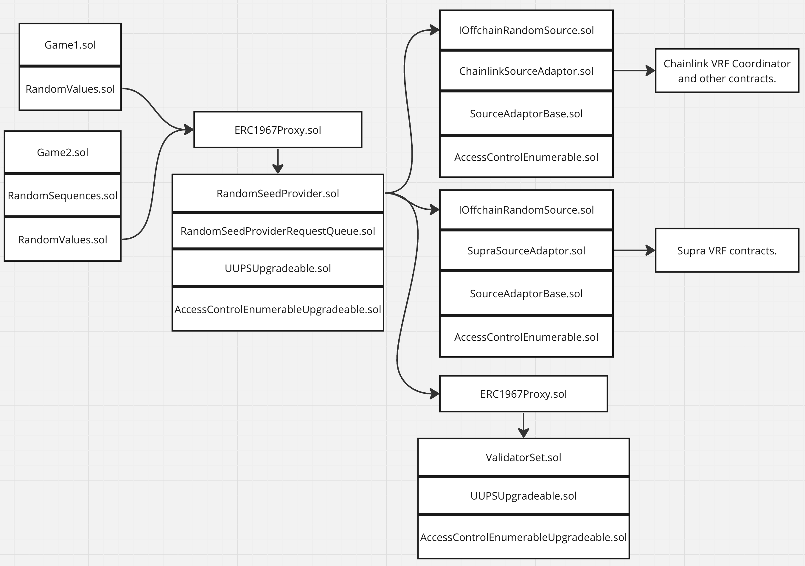

# Random Number Generation Threat Model

# Contents

- [Introduction](#introduction)
- [Rationale](#rationale)
- [Threat Model Scope](#threat-model-scope)
- [Background: Random Number Generation on Blockchain](#background-random-number-generation-on-blockchain)
- [Architecture](#architecture)
- [Attack Surfaces](#attack-surfaces)
- [Perceived Attackers](#preceived-attackers)
- [Attack Mitigation](#attack-mitigation)
- [Conclusion](#conclusion)


# Introduction

This threat model document for the Random Number Generation contracts has been created in preparation for external audit. This document is also written as a detailed reference for the generation of random numbers on Immutable zkEVM and Immutable Dedicated zkEVMs.  


# Rationale

The reasons why a game might choose to use Immutable's random number generator solution, rather than creating their own solution is:

* Though it is simple to generate numbers that appear to be random on-chain, it is very difficult to generate random numbers that are not susceptible to calculation or guessing within a constained set of numbers by sufficiently motivated blockchain savvy game players. 
* Enables games to leverage a random number generation system that has been designed by Immutable's cryptographers, has been widely reviewed, and will be (in Q2, 2024) audited by a top tier blockchain auditing company.
* Allows games to build their game against an API that won't change, even as the underlying mechanics of the random number generation process changes. 
* For off-chain randomness, allows games to leverage the random number provider that Immutable has agreements with. That is, rather than every game negotiating an agreement with a VRF provider, and paying them, Immutable pays a VRF provider and supplies the numbers to approved games. Multiple games may use the same VRF value as a seed, from which they generate unique random values. Re-using the same off-chain random value saves money and reduces block utilization.


# Threat Model Scope
The threat model is limited to the following Solidity files at GitHash [TBD](TBD): 

* [RandomSeedProvider.sol](TBD)
* [RandomSeedProviderQueue.sol](TBD)
* [RandomValues.sol](TBD)
* [RandomSequences.sol](TBD)
* [IOffchainRandomSource.sol](TBD)
* [SourceAdaptorBase.sol](TBD)
* [HashOnion.sol](TBD)


# Background: Random Number Generation on Blockchain
The following sections provide background material on the random number generation process on Immutable zkEVM and Immutable Dedicated zkEVMs.

## Uses of Random Numbers in Games on the Immutable zkEVM Platform
In games there are two types of uses for random numbers:
* Deciding non-financial non-deterministic events. For example:
  * Which direction a non-player character walk in next.
* Deciding financial non-deterministic events. For example:
  * The attributes of a randomly generated NFT.
  * The contents of a loot box.
  * The next card to be drawn from a deck of cards when playing poker.

Non-financial non-deterministic events need Non-Secure Random Numbers. Game studios are encouraged to generate these numbers using standard game SDKs, and not using the blockchain. Financial non-deterministic events need Secure Random Numbers. These numbers should be supplied using the system described in this document.


## Generalised Process for Generating a Secure Random Number
A two step process across two blockchain transactions is required for generating Secure Random Numbers:

* Transaction 1: Do an action that results in a request for a Secure Random Number to be generated. In some games this action could involve some form of payment. A request id is returned. 
* Transaction 2: Fulfil the action from transaction 1 by returning the generated number based on the request id.

Separating the process across two transactions is required as otherwise, if the process was included in a single transaction, the game player could request a random number be generated, and then revert the transaction if the random output was not one that they wanted. The game player could repeat the process until the random number generated was one that they did want. This scenario is partcularly applicable to the Immutable zkEVM where game players use the Immutable Passport wallet contract. These contracts have multi-call capability, allowing the game player to call the game contract in one call and then assess the result of any action in a secondary call, all done within the one transaction.

Linking requests to fulfillment actions using a request id is important to ensure the game player is locked into which random number they will receive. Not using an identifier linking the request and fulfillment could allow the game player to choose which fulfillment action to utilise, reverting ones that are not advantageous to them.

If a payment is going to be involved in the overall game action that results in the random number being generated, then this payment must happen in the first transaction. This is important as it locks the user into paying for the random number, no matter what the outcome of the random generation process.

Note that despite the two transaction approach described above, the solution described in this document includes a mechanism that requires only one transaction per random value generation. This *sequences* methodology is appropriate for some situations, and not others.

## Random Seeds vs Random Numbers
Random number sources for blockchain typically can produce one value per block. However, multiple games may need multiple random numbers for multiple players all in the same block. To achieve this blockchain random values (for example the block hash) are treated as random seed values from which are derived personalised random numbers. Random numbers are personalised based on the following factors:

* Game contract address. This will be deemed to be a proxy for the game itself.
* msg.sender address. This will be deemed to be a proxy for the user. The assumption is that either an EOA (Externally Owned Account, that is a Metamask wallet account), or a Passport contract will interact directly with the game contract.
* Random request id. This number is different for each request to ensure even if the same player requests multiple random numbers in the same block or even within the same transaction, they will be different. This has been implemented as an incrementing number that starts at zero when the game is deployed.

These factors will ensure seed values translate to random numbers that are unique for all game players in all games for each random number request. 

## Random Number Expansion
Sometimes games will need several random numbers based on one random request. A Pseudo Random Function (PRF) is used to generate an array of numbers from one personalised random number using the following equation.

```
random values[i] = keccak256(random value, i)
```

## Combining Random Sources
Typically with random number generation, multiple low quality sources can be combined to produce a higher quality source. This combination approach does not apply to blockchains. The reason is that the random generation process occurs inside of a virtual machine which is controlled by block producers. Combining high quality off-chain random sources with random sources that the block producers control negates the randomness of the off-chain source. Hence, the random generation system does not to combine random sources.

## On-Chain Sources of Random Seed Values
This section describes the possible sources of random values on Immutable zkEVM. These sources have the advantage over off-chain sources that they are free. The disadvantage of these approaches is that they are susceptible to block producer manipulation.

### Previous Block’s Block Hash
In Ethereum based blockchains, including Immutable zkEVM, the Block Hash is the message digest of the block header of a block, exlcuding the Extra Data field. This is the “finger print” of all transactions that have occurred on the chain since genesis. 

Solidity contract code obtains the value by calling `blockhash(<block number>)`. This in turn calls an opcode that returns the blockhash. The block number can be any of the previous 256 blocks. 

### Previous Block’s RANDAO
*Note that prior to the PoS BFT fork, this value will be a predictable value related to the block number.*

RanDAO is an algorithm for generating random numbers in a decentralised way.  Immutable will use the Hash Onion approach, in which all validators commit to a recursive hash value, and the block producer reveals a new value once per block. The process is described here: [Decentralized Random Number Generation](https://youtu.be/ExAhv5HudMM?t=663) 

Solidity contract code obtains the value by calling block.prevrandao. This in turn calls an opcode that returns the RANDAO value for the previous block. The value is also included in the block header, thus adding uncertainty to the value of `blockhash<block number>`.

### Verifiable Random Functions (VRF) 
A Verifiable Random Function (VRF)([academic paper](https://eprint.iacr.org/2017/099.pdf), [blog](https://supra.com/academy/chainlink-vrf/)) is an algorithm for securely generating random numbers. A generator has a public / private key pair. The private key is combined with an input value α produce a certain output value β. The public key combined with the input value α can be used to check that the output value β was generated using the private key according to the generation algorithm.

Chainlink, Supra, and others have created Verifiable Random Function (VRF) services. Chainlink uses a single private key and service, with fail-over capability to a secondary service. Supra's service involves a form of Multi-Party Computation (MPC) so that the “private key” is a sharded key share. In this way, if one key shard is compromised, then the overall “private key” is still secure.

For Chainlink, a `VRFCoordinator` contract (part of a set of contracts by Chainlink) is deployed to the chain. A call is made to the `VRFCoordinator` contract’s `requestRandomWords` function, passing in a subscription ID and the key pair to use, which returns a request id. Some blocks later, the request is fulfilled. The transaction to fulfil the request first verifies the generated number and then calls a call-back function to return the random value.


# Architecture

## Top Level Architecture

The Random Number Generation system on the Immutable platform is shown in the diagram below.



Game contracts can extend `RandomValues.sol` or `RandomSequences.sol`. 
`RandomSequences.sol` is an extension of `RandomValues.sol`. 
`RandomValues.sol` interacts with the `RandomSeedProvider.sol` contract to request and retreive random seed values. 

There is one `RandomSeedProvider.sol` contract deployed per chain. Each game has its own instance game contract that extends `RandomValues.sol` or `RandomSequences.sol`. 

The `RandomSeedProvider.sol` operates behind a transparent proxy, `ERC1967Proxy.sol`, with the upgrade
logic included in the `UUPSUpgradeable.sol` contract that `RandomSeedProvider.sol` extends. Using an upgradeable pattern allows the random manager contract to be upgraded to extend its feature set and resolve issues. 

The `RandomSeedProvider.sol` contract by default uses an on-chain random number source. It can be configured to use an off-chain random number source. This source is accessed via the `IOffchainRandomSource.sol` interface. To allow the flexibility to switch between off-chain random sources, there is an adaptor contract between the offchain random source contract and the random seed provider. Common logic for adaptor implementations is held in `SourceAdaptorBase.sol`.

The `RandomSeedProvider.sol` contract uses a queue implemented in `RandomSeedProviderRequestQueue.sol` to hold outstanding requests for on-chain generated random seed values. Having a separate implementation more easily allows the code to be easily unit tested. 

The HashOnion.sol contract implements a deterministic number source by incrementally revealing recursive hash pre-images. This allows values that are unknown to game players, but deterministic so that they can't be manipulated, to be put on chain during periods of low chain utilization. This is useful to increase the amount of entropy on the chain, thus making on-chain seed values more difficult to predict.

The architecture diagram shows a ChainLink VRF source and a Supra VRF source. This is purely to show the possibility of integrating with one off-chain service and then, at a later point choosing to switch to an alternative off-chain source. At present, there is no agreement to use any specific off-chain source.

`RandomValues.sol` provides an API in which random numbers are requested in one transaction and then 
fulfilled in a later transaction. `RandomSequences.sol` provides an API in which a random number
is supplied and the next one is requested in the same transaction. Whereas the API offered by 
`RandomValues.sol` provides numbers that can not be predicted, the API offered by 
`RandomSequences.sol` means that savvy game players that can analyse blockchain state can 
predict the next random value to be generated. However, they are unable to change the random number 
that will be generated. `RandomSequences.sol`'s API can be used securely by ensuring 
the purpose of random numbers used in a game are clearly segregated, and that a different
sequence type is given for each purpose when requesting random values. 


## Random Seed Provider Design
This section explains the security relevant aspects of the Random Seed Provider contract.

### Random Source
A random source is defined as where a random request will be fulfilled from. The random source has three distinct values:

* 0: The random source has not been set.
* 1: The random source is on-chain.
* An address: The address of an off-chain source adaptor contract.

When a game requests a random seed, it is returned a fulfillment identifier and a source id. The reason for supplying the source id is that the default source for the game could change between when the number is requested and when it is fulfilled. Forcing games to supply the source means that the number will be able to be supplied, even if the game would use another source for new seed requests.

The Random Seed Provider can have none or one off-chain source configured at a time. The off-chain source can be switched using the `setOffchainRandomSource` function. The off-chain source can be removed by passing in `address(1)` to the `setOffchainRandomSource` function, thus setting the random source to on-chain.

Even if an off-chain source has been configured, only authorised games can use the off-chain source. The reason for this restriction is that requesting off-chain random numbers will incur cost. A malicious game could maliciously request many random numbers, thus forcing the system to incur major cost for no benefit. Games can be added to the authorised list of games using the `addOffchainRandomConsumer` function and removed from the list using the `removeOffchainRandomConsumer` function.


### Personalization of On-Chain Random Source to Immutable zkEVM
The on-chain random sequence is personalised to the blockchain the code is executing on and when the random number generation system starts. Doing this ensures that different output is generated even if the same system is executed in similar conditions on multiple chains simultaneously.

The following code is executed in the initializer, localising the seed values to the chain id and the block hash of the previous block.

```Solidity
prevRandomOutput = keccak256(abi.encodePacked(block.chainid, blockhash(block.number - 1)));
```
This value is then later combined with the random output thus:
```Solidity
bytes32 prev = prevRandomOutput;
...
uint256 entropy = uint256(blockhash(blockNumber));
prev = keccak256(abi.encodePacked(prev, entropy));
randomOutput[blockNumber] = prev;

...
prevRandomOutput = prev;
```

### On-Chain Random Request
The block hash of a future block is used as the on-chain random source. Games request a seed value using the `requestRandomSeed` function and are returned the random source and a fulfillment identifier. This identifier is the block number to determine the block hash for. 

The block hash has been chosen as historic values from the previous 256 blocks is available via the block hash opcode. This means any service to fulfil requests only needs to run intermittently, and not every block or every second block. This is important both from a block space utilisation perspective, where the goal is to leave as much block space for games as possible, and from a cost perspective. 

The block number to determine the block hash of is recorded in the Random Seed provider's queue. 

### On-Chain Random Delay
There is a delay between when a game requests a random seed value and when it is fulfilled. The default value is two blocks. This value can be set by an appropriately authorised administrator. To help understand what the delay means in terms of requesting blocks:

Assuming a delay of 2 blocks (the default) then:
* Current block number + 0: The block the game requested the seed in.
* Current block number + 2: This block's block hash is used as entropy.
* Current block number + 3: The value can now be generated based on the request.

Note that limits are placed on the possible values of on-chain delay. A delay of 0 would be mean using the block hash for the block that the game requested the random seed in. This would not be secure as the game player could observe the transaction pool, see the previous block's block hash, and attempt to determine a range of likely block hashes. They could then alter their transaction, in an attempt of generating a block hash that is favourable to them. As such, a value of 0 is not acceptable.

In an effort to protect the system from an administrator mistakenly setting the delay to an excessively high value, the maximum delay is 30 blocks. Given a two second block time, this equates to a one minute delay between requests and fulfillment. This seems like a large maximum value. The contract can be upgraded in the unlikely event that a larger value needs to set.

### On-Chain Random Fulfillment
Seed values are produced by calling the `generateNextSeedOnChain` function. This function can either be called directly, typically by a platform operated service, or via the `getRandomSeed` function.

The `generateNextSeedOnChain` function takes block numbers from the Random Seed Provider's queue. When analysing the block numbers, there are three possible scenarios:

* The block is more than 256 blocks ago. In this case it is too late to determine the block hash. Games need to request a new random seed in this case.
* The block number is for the current block or for a future block. In this case, the block hash can't be determined yet.
* The block number is for a block between one and 256 blocks ago. The block hash is requested using the block hash opcode and stored in a map of block number to block hash for later use. 

The `getRandomSeed` function returns seed values from the map of block number to block hash. The function reverts if the `generateNextSeedOnChain` function wasn't called in time given the block number, or if the block number is for the current block is is in the future. 

The `isRandomSeedReady` function returns the generation status, with the possible status values matching the happy and two revert cases of the `getRandomSeed` function.

### Off-chain Sources
The Random Seed Provider delegates calls to the `requestRandomSeed`, `getRandomSeed`, and `isRandomSeedReady` functions to an off-chain random source via the `IOffchainRandomSource.sol` interface.

### Random Seed Provider Approach to Upgrade
The Random Seed Provider contract uses a Universal Upgradeable Proxy Standard (UUPS) upgrade paradigm. An admin with upgrade priviledges calls the `upgradeToAndCall` function, which in turn calls the `_authorizeUpgrade` function, which does the authorisation check. `upgradeToAndCall` allows a function in the new application logic contract to be specified and called. This function must be specified as the `upgrade` function.

The `upgrade` function must be written such that it is permissionless and will only run once for each upgrade. It must be able to be run against any version of the Random Seed Provider contract: the original version 0, and future versions. It needs to detect the version as supplied by the storage value `version` and compare that with the source code version being executed.

### Random Seed Provider Roles
The Random Seed Provider supports the following roles:

* Default Admin: Creates and removes other administrators.
* Random Admin: Call the following configuration functions:
  * `setOffchainRandomSource`
  * `setOnChainDelay`
  * `addOffchainRandomConsumer`
  * `removeOffchainRandomConsumer`
* Upgrade Admin: Can upgrade the contract.


## Off-chain Random Source Interface and Source Adaptor Base Design
The section describes the `IOffchainRandomSource.sol` interface and `SourceAdaptorBase.sol`. The `IOffchainRandomSource` interface defines all the functions that off-chain source must implement. The `SourceAdaptorBase.sol` provides common implementations for most of the functions. Add off-chain source adaptors should extend `SourceAdaptorBase.sol`.

### Request Off-chain Random
The `requestOffchainRandom` function requests a random value. This function in turn calls the off-chain provider's appropriate request function. The functions returns an off-chain provider specific fulfillment identifier.

### Fulfil Random Words
The `_fulfilRandomWords` function is defined in `SourceAdaptorBase.sol` as an internal function. External functions defined in off-chain adaptor contracts must call this function only after authenticating msg.sender to check that the `_fulfilRandomWords` function is being called by the off-chain provider's VRF contract only.

The `_fulfilRandomWords` function only requests one word. This is because the off-chain random providers do seed expansion using a PRF, in a similar way to how it is done in the `RandomValues.sol`. The system in this document just needs a single seed value, and can derive other values from it.

The `_fulfilRandomWords` function stores values returned by off-chain providers in a map of fulfillment identifier to random value. 

### Get Off-chain Random
The 'getOffchainRandom' function fetches random values from the map of fulfillment identifier to random value. It has been assumed that the off-chain provider operates perfectly, and that if a value does not exist in the map then this indicates that value has not yet been generated.

### Is Off-chain Random Ready
The `isOffchainRandomReady` returns whether a random value for a fulfillment identifier exists in the fulfillment identifier to random value map or not. If it does, then the function returns indicating the value is ready and can be successfully fetched using the `getOffchainRandom` function.

### Source Adaptor Upgrade Approach
Off-chain source adaptor contracts are not upgradeable. If there is an issue with the code, a new version shoudl be deployed, and the random seed provider shoudl point to the new version.

### Source Adaptor Base Roles
The Source Adaptor Base supports the following roles:

* Default Admin: Creates and removes other administrators.
* Config Admin: Configures adaptor specific configuration.


## Random Values Design

TODO talk about generating id, rather being passed in.

TODO talk about size being specified, rather than being dynamic

TODO talk about storing source as well as id, and source is address thus allowing for changing / upgrading source

## Random Sequences Design


## Other Information

This section provides links to all source code, test plans, test code.

### TODO Source Code
TODO update

This threat model pertains to the following source code:

- [RootERC20PredicateFlowRate.sol](https://github.com/immutable/poly-core-contracts/blob/d0a3be95ac9d2d7820903558d4668197f9d77d9a/contracts/root/flowrate/RootERC20PredicateFlowRate.sol): Version of ERC 20 Bridge contract to be deployed on Ethereum for ERC 20 tokens that originate on Ethereum, that includes security features.


### TODO Test Plans
TODO update


The following test plans were created to evaluate the tests required for adding Ether support and the security enhancements to the ERC 20 bridge. All tests described in the test plans were implemented.

- [Root ERC 20 Predicate, Ether Support](https://github.com/immutable/poly-core-contracts/blob/d0a3be95ac9d2d7820903558d4668197f9d77d9a/test/forge/root/RootERC20Predicate.tree)
- [Root ERC 20 Predicate, Security Enhancements](https://github.com/immutable/poly-core-contracts/blob/d0a3be95ac9d2d7820903558d4668197f9d77d9a/test/forge/root/flowrate/README.md)

### TODO Test Code
TODO update


The following test code was created to test the ERC 20 bridge Ether support and security enhancements.

- [Tests for RootERC20Predicate.sol, focusing on Ether support](https://github.com/immutable/poly-core-contracts/blob/d0a3be95ac9d2d7820903558d4668197f9d77d9a/test/forge/root/RootERC20Predicate.t.sol)


### TODO Continuous Integration

TODO REvise Each time a commit is pushed to a pull request, the [continuous integration loop executes](https://github.com/immutable/poly-core-contracts/actions).

### TODO Building, Testing, Coverage and Static Code Analysis

TODO: Revise 
For instructions on building the code, running tests, coverage, and Slither, see the [Using this Repo](https://github.com/immutable/poly-core-contracts/blob/d0a3be95ac9d2d7820903558d4668197f9d77d9a/README.md#using-this-repo) section of the README.md at the root of this repo.

# Attack Surfaces

The following sections list attack surfaces evaluated as part of this threat modelling exercise.

## TODO RootERC20PredicateFlowRate Externally Visible Functions

This section describes the externally visible functions available in `RootERC20PredicateFlowRate`. An attacker could formulate an attack in which they send one or more transactions that execute one or more of these functions.

The table below shows the list of externally visible functions. In addition to the name and function selector, the function type (transaction or view), and access control mechanisms are listed.

The list of functions and their function selectors was determined by the following command. The additional information was obtained by reviewing the code.

```
cd contracts/root/flowrate
forge inspect RootERC20PredicateFlowRate --pretty methods
```

| Name                                                                                 | Function Selector | Type        | Access Control       |
| ------------------------------------------------------------------------------------ | ----------------- | ----------- | -------------------- |
| DEFAULT_ADMIN_ROLE()                                                                 | a217fddf          | view        | -                    |
| DEPOSIT_SIG()                                                                        | d41f1771          | view        | -                    |
| MAP_TOKEN_SIG()                                                                      | f6451255          | view        | -                    |
| NATIVE_TOKEN()                                                                       | 31f7d964          | view        | -                    |
| WITHDRAW_SIG()                                                                       | b1768065          | view        | -                    |
| activateWithdrawalQueue()                                                            | af8bbb5e          | transaction | RATE role            |
| childERC20Predicate()                                                                | d57184e4          | view        | -                    |


## TODO Immutable zkEVM Validators: Block Hash Attack

## TODO Immutable zkEVM Validators: RANDAO Attack

## TODO VRF Key Compromise

## TODO Reuse a Random Value 


## TODO Accounts with DEFAULT_ADMIN, PAUSE, UNPAUSE, and RATE roles

Accounts with administrative privileges could be used by attackers to facilitate attacks. For example, an attacker could maliciously pause the bridge thus disrupting the bridge. Alternatively, used in conjunction with other attacks, the attacker could post malicious exits, which might enter the withdrawal queue, and then disable the withdrawal queue. Exploiting this attack surface requires compromising the administrative accounts with certain administrative roles.

## TODO: RootERC20PredicateFlowRate, ExitHelper, CheckpointManager, CustomSupernetsManager Contract Upgrade

This RootERC20PredicateFlowRate, ExitHelper, CheckpointManager, CustomSupernetsManager, StakeManager, and StateSender contracts are each deployed with a [TransparentUpgradeProxy](https://github.com/OpenZeppelin/openzeppelin-contracts/blob/17c1a3a4584e2cbbca4131f2f1d16168c92f2310/contracts/proxy/transparent/TransparentUpgradeableProxy.sol) and a [Proxy Admin](https://github.com/OpenZeppelin/openzeppelin-contracts/blob/17c1a3a4584e2cbbca4131f2f1d16168c92f2310/contracts/proxy/transparent/ProxyAdmin.sol) contract. An account, that can be thought of as the Proxy Administrator, deploys the `TransparentUpgradeProxy` contract and the `ProxyAdmin` contract. This Proxy Administrator can at some later point call the [upgradeAndCall](https://github.com/OpenZeppelin/openzeppelin-contracts/blob/17c1a3a4584e2cbbca4131f2f1d16168c92f2310/contracts/proxy/transparent/ProxyAdmin.sol#L74) function to upgrade the implementation of the contract. The `TransparentUpgradeProxy` contract executes code in the contracts via `delegateCall`, thus executing the code in logic contract in the context of the `TransparentUpgradeProxy` contract. For example, the Proxy Administrator could use the ability to update the implementation of `RootERC20PredicateFlowRate` to deploy a malicious version of the contract.Exploiting this attack surface requires compromising the administrative account responsible for upgrading the contracts.

## RandomSeedProvider Contract Storage Slots: Upgrade

An attack vector on future versions of this contract could be misaligned storage slots between a version and the subsequent version. That is, a new storage variable could be added without adjusting the storage gap variable for the file the variable is added to, thus moving the storage locations used by the new version of code relative to the old version of code. To monitor this attack surface, the storage slot utilisation or this initial version is shown in the table below. The table was constructed by using the command described below, and analysing the source code.

```
forge inspect RandomSeedProvider --pretty storage
```

| Name                              | Type                                                           | Slot | Offset | Bytes | Source File |
| --------------------------------- | -------------------------------------------------------------- | ---- | ------ | ----- | ----------- |
| \_initialized                     | uint8                                                          | 0    | 0      | 1     | OpenZeppelin Contracts v4.9.3: proxy/utils/Initializable.sol |
| \_initializing                    | bool                                                           | 0    | 1      | 1     | OpenZeppelin Contracts v4.9.3: proxy/utils/Initializable.sol |
| \_\_gap                           | uint256[50]                                                    | 1    | 0      | 1600  | OpenZeppelin Contracts v4.9.3: utils/Context.sol)            |
| \_\_gap                           | uint256[50]                                                    | 51   | 0      | 1600  | OpenZeppelin Contracts v4.9.3: utils/introspection/ERC165.sol |
| \_roles                           | mapping(bytes32 => struct AccessControlUpgradeable.RoleData)   | 101  | 0      | 32    | OpenZeppelin Contracts v4.9.3: access/AccessControlUpgradeable.sol |
| \_\_gap                           | uint256[49]                                                    | 102  | 0      | 1568  | OpenZeppelin Contracts v4.9.3: access/AccessControlUpgradeable.sol |
| \_roleMembers                     | mapping(bytes32 => struct EnumerableSetUpgradeable.AddressSet) | 151  | 0      | 32    | OpenZeppelin Contracts v4.9.3: access/AccessControlEnumerableUpgradeable.sol |
| \_\_gap                           | uint256[49]                                                    | 152  | 0      | 1568  | OpenZeppelin Contracts v4.9.3: access/AccessControlEnumerableUpgradeable.sol |
| \_\_gap                           | uint256[50]                                                    | 201  | 0      | 1600  | OpenZeppelin Contracts v4.9.3: proxy/ERC1967/ERC1967Upgrade.sol |
| \_\_gap                           | uint256[50]                                                    | 251  | 0      | 1600  | OpenZeppelin Contracts v4.9.3: proxy/utils/UUPSUpgradeable.sol  |
| outstandingRequests               | mapping(uint256 => uint256)                                    | 301  | 0      | 32    | contracts/random/RandomSeedProviderRequestQueue.sol             |
| outstandingRequestsTail           | uint256                                                        | 302  | 0      | 32    | contracts/random/RandomSeedProviderRequestQueue.sol |
| outstandingRequestsHead           | uint256                                                        | 303  | 0      | 32    | contracts/random/RandomSeedProviderRequestQueue.sol |
| \_\_gapRandomSeedProviderRequestQueue | uint256[100]                                               | 304  | 0      | 3200  | contracts/random/RandomSeedProviderRequestQueue.sol  |
| version                           | uint256                                                        | 404  | 0      | 32    | contracts/random/RandomSeedProvider.sol:RandomSeedProvider |
| randomOutput                      | mapping(uint256 => bytes32)                                    | 405  | 0      | 32    | contracts/random/RandomSeedProvider.sol:RandomSeedProvider |
| lastBlockOffchainRequest          | uint256                                                        | 406  | 0      | 32    | contracts/random/RandomSeedProvider.sol:RandomSeedProvider |
| prevOffchainRandomRequest         | uint256                                                        | 407  | 0      | 32    | contracts/random/RandomSeedProvider.sol:RandomSeedProvider |
| randomSource                      | address                                                        | 408  | 0      | 20    | contracts/random/RandomSeedProvider.sol:RandomSeedProvider |
| onChainDelay                      | uint256                                                        | 409  | 0      | 32    | contracts/random/RandomSeedProvider.sol:RandomSeedProvider |
| approvedForOffchainRandom         | mapping(address => bool)                                       | 410  | 0      | 32    | contracts/random/RandomSeedProvider.sol:RandomSeedProvider |
| \_\_gapRandomSeedProvider         | uint256[100]                                                   | 411  | 0      | 3200  | contracts/random/RandomSeedProvider.sol:RandomSeedProvider |


# Perceived Attackers

This section lists the attackers that could attack the ERC 20 bridge system.

It is assumed that all attackers have access to all documentation and source code of all systems related to the Immutable zkEVM, irrespective of whether the information resides in a public or private GitHub repository, email, Slack, Confluence, or any other information system.

## General Public

The General Public attacker can submit transactions on Ethereum or on the Immutable zkEVM. They use the standard interfaces of contracts to attempt to compromise the briding system.

## MEV Bot

MEV Bots observe transactions in the transaction pool either on Immutable zkEVM. They can front run transactions.

## Immutable zkEVM Block Proposer

TODO: Operator of an Ethereum Block Proposer could, within narrow limits, alter the block time stamp of the block they produce. If this block included transactions related to the withdrawal queue or flow rate mechanism, they might be able to have an affect on this mechanism.

## TODO: Spear Phisher

This attacker compromises accounts of people by using Spear Phishing attacks. For example they send a malicious PDF file to a user, which the user opens, the PDF file then installs malware on the user's computer. At this point, it is assumed that the Spear Phisher Attacker can detect all key strokes, mouse clicks, see all information retrieved, see any file in the user's file system, and execute any program on the user's computer.

## TODO: Server Powner

This attacker is able to compromise any server computer, _Powerfully Owning_ the computer. For instance, they can compromise a validator node on the Immutable zkEVM. They might do this by finding a buffer overflow vulnerability in the public API of the computer. They can read values from the computer's RAM. Importantly, they can access the BLS private key of the validator node.

## TODO: Insider

This attacker works for a company helping operate the Immutable zkEVM. This attacker could be being bribed or blackmailed. They can access the keys that they as an individual employee has access to. For instance, they might be one of the signers of the multi-signer administrative role.

# Attack Mitigation


*Game Player Attacks*: Game players could observe blocks as they are being produced, and hence know the value of the block hash for the previous block. They might observe that at that point in time, the blockchain had low utilisation. They could assume that the there would be no transactions for the block that they submit their random seed request in and subsequent blocks until they fulfil their request. They could predict the block producer, and hence the value of the coinbase account. 

The Game Player could attempt to submit a transaction based on the random value and have it submitted in time for inclusion in the next block. They could choose when to do this based on their estimation of when 

Hence, a delay of at least one block should be imposed between when a game player requests a number and when the random number is fulfilled.

Block Producer Manipulation: The block producer could manipulate the block hash by crafting a transaction that included a number that the block producer controls. A malicious block producer could produce many candidate blocks, in an attempt to produce a specific block hash value. In this attack, block producers will be limited to four seconds (which will probably be only one or two seconds in practice) to mount their attack. They would need to have received the previous block (which takes somewhere between 0 and 2 seconds to generate), generate the transaction to manipulate the block hash value, and then send the propose block through the consensus process (which takes between 0 and 2 seconds to generate).

TODO: Attack where another game requests one number per block, but never fulfils, thus forcing other games to absorb the cost / pay for the cost. 

### RanDAO Attacks

Game Player Attacks: Same as for Block Hash approach.

Block Producer Manipulation: The RanDAO value can be influenced by a block producer deciding to produce or not produce a block. This limits the block producer's influence to one of two values: the value which it will produce, or the value that another replacement block producer will generate. A priori, it doesn’t know the value that the replacement block producer will generate, so it is left with the choice of a value it knows or an unknown value. 

If a block producer chose to not produce a block, it will not earn block rewards that it could have earned. Additionally, this behaviour of not producing a block could be tracked.


This section outlines possible attacks against the attack surfaces by the attackers, and how those attacks are mitigated.

## Overview of Attacks on Functions in RootERC20PredicateFlowRate

The functions in RootERC20PredicateFlowRate fall into five categories:

- View functions that don't update state. These functions can not be used to attack the system as they do not alter the state of the blockchain.
- Transaction functions that have access control. These functions are considered in the section [Functions with Access Control](#functions-with-access-control).
- Transaction functions that have no access control. These functions are considered in the section [Functions with no Access Control](#functions-with-no-access-control).
- The `onL2StateReceive(uint256,address,bytes)` function has a form of access control, being limited to only being called by the `ExitHelper`. It is considered in the section [onL2StateReceiver](#onl2statereceive).
- The `initialize(address,address,address,address,address)` function is needed for compatibility with `RootERC20Predicate`. Transactions that call this function in the context of `RootERC20PredicateFlowRate` revert.
- The `initialize(address,address,address,address,address, address,address,address,address)` function can only be called once. It is called by the [TransparentUpgradeProxy](https://github.com/OpenZeppelin/openzeppelin-contracts/blob/17c1a3a4584e2cbbca4131f2f1d16168c92f2310/contracts/proxy/transparent/TransparentUpgradeableProxy.sol) during the `TransparentUpgradeProxy`'s [constructor](https://github.com/OpenZeppelin/openzeppelin-contracts/blob/17c1a3a4584e2cbbca4131f2f1d16168c92f2310/contracts/proxy/ERC1967/ERC1967Proxy.sol#L23), in the [context of the `TransparentUpgradeProxy`](https://github.com/OpenZeppelin/openzeppelin-contracts/blob/17c1a3a4584e2cbbca4131f2f1d16168c92f2310/contracts/proxy/ERC1967/ERC1967Upgrade.sol#L62). An attacker could not call this function again in the context of the `TransparentUpgradeProxy`, as it reverts when called a second time. Calling this function on the `RootERC20PredicateFlowRate` contract directly would only change the state of `RootERC20PredicateFlowRate`, and not that of the `TransparentUpgradeProxy`.

## Attacks on RootERC20PredicateFlowRate Functions with no Access Control

The [General Public Attacker](#general-public) could attempt to attack functions with no access control. The [MEV Bot Attacker](#mev-bot) could see transactions to these functions and attempt to front run them. The following sections analyse what a [General Public Attacker](#general-public) and an [MEV Bot Attacker](#mev-bot) could achieve.

### deposit(address,uint256), depositTo(address,address,uint256), and depositNativeTo(address)

The `deposit` and `depositTo` functions allow users to deposit ERC 20 tokens into the bridge, and have them bridged to the Immutable zkEVM. The `depositNativeTo` allows users to deposit Ether into the bridge, and wrapped Ether tokens bridge to the Immutable zkEVM. For the function variants ending in `To`, the recipient account on the Immutable zkEVM can be specified.

Attackers need to supply their own tokens. They are unable to switch the type of token to a more desirable token, or increase the amount of tokens they receive. The [General Public Attacker](#general-public) and the [MEV Bot Attacker](#mev-bot) are unable to mount successful attacks on these functions.

### finaliseQueuedWithdrawal(address,uint256) and finaliseQueuedWithdrawalsAggregated(address,address,uint256[])

The `finaliseQueuedWithdrawal` and the `finaliseQueuedWithdrawalsAggregated` allow withdrawals that are in the withdrawal queue to be dequeued and the funds distributed. Whereas the `finaliseQueuedWithdrawal` finalises one withdrawal, the `finaliseQueuedWithdrawalsAggregated` allows multiple withdrawals for the same token to be accumulated into a single withdrawal, thus saving on gas cost of executing multiple ERC 20 transfers or multiple Ether transfers.

The receiver of the funds is specified in the function call. The receiver only receives tokens or Ether that are in their withdrawal queue, and which have been in the withdrawal queue longer than the withdrawal period. The `finaliseQueuedWithdrawalsAggregated` checks that all withdrawals are for the same specified token.

The [General Public Attacker](#general-public) could send the receiver some coins that the receiver did not want. For example, they could attempt to implicate the receiver in a scandal, by sending the receiver tainted coins. Then, despite the receiver not finalising the tainted coins, a [General Public Attacker](#general-public) could finalise the coins on the receiver's behalf. This is not deemed to be an attack as the account submitting the transaction to `finaliseQueuedWithdrawal` or `finaliseQueuedWithdrawalsAggregated` to dequeue the tainted coins is recorded in Ethereum, and could be readily identified as not being associated with the receiver.

The [MEV Bot Attacker](#mev-bot) can not front run these calls as the tokens are sent to the receiver, and not to `msg.sender`.

The [Ethereum Block Proposer](#ethereum-block-proposer) could mount an attack by slightly altering the [block timestamp](#ethereum-block-timing-attacks). The attacker could force a withdrawal that was on the very of becoming available to have to wait an extra block. Any transactions hoping to finalise the withdrawal would revert as the finalise function call would be deemed too early. The attacker could change the block timestamp slightly, thus causing a withdrawal to cause the automatic flow rate detection mechanism to activate. These attacks seem unlikely to occur because [Ethereum Block Proposers](#ethereum-block-proposer) are not focused on attacking the Immutable zkEVM, a single system within the larger Ethereum ecosystem. Additionally, these attacks on withdrawal time or flow rate are only slightly moving the timing and thresholds, in a way that is insignificant relative to the standard settings. That is, the default withdrawal delay is one day. Causing the delay to be even one second longer appears insignificant. Assuming the flow rate bucket has its capacity set such that it is averaging the flow rate over a period of an hour or more, changing the block timestamp by even a second will have little effect.

### mapToken(address)

The `mapToken` function sets the mapping between a token contract address on Ethereum and the corresponding token contract on the Immutable zkEVM. The mapping algorithm is deterministic. The function call initiates a crosschain transaction, which results in the token contract on the Immutable zkEVM being deployed.

The [General Public Attacker](#general-public) could call this function multiple times for any token. They could then complete the crosschain transaction on the Immutable zkEVM, calling `commit` on the `StateReceiver` contract. The first time the function was called, the `ChildERC20Predicate` contract would deploy the contract. On the second attempt the function call would revert when the `ChildERC20Predicate` contract attempted to re-deploy the token contract. As such, the only possible attack could be that the [General Public Attacker](#general-public) deploys a multitude of ERC 20 contracts, filling up the Immutable zkEVM state. This is not deemed a significant attack.

The [MEV Bot Attacker](#mev-bot) would gain no benefit from front running calls to this function. As such, it would not call this function.

## Attacks on RootERC20PredicateFlowRate Functions with Access Control

The table below outlines functions in `RootERC20PredicateFlowRate` that have access control. The mitigation for all is to assume that all roles will be operated by multi-signature addresses such that an attacker would need to compromise multiple signers simultaneously. As such, even if some keys are compromised due to the [Spear Phishing Attacker](#spear-phisher) or the [Insider Attacker](#insider), the administrative actions will not be able to be executed as a threshold number of keys will not be available.

It should be noted that the intention is to have the threshold of number of signatures for the PAUSE role lower than for the other roles to make it easier for administrators to pause the bridge in a time of attack. However, the threshold will still be high enough that it will be difficult for an attacker to successfully mount such an attack. Even if they did successfully mount this attack, they would cause reputational damage, but would be unable to steal funds.

| Name                                                     | Function Selector | Type        | Access Control       |
| -------------------------------------------------------- | ----------------- | ----------- | -------------------- |
| activateWithdrawalQueue()                                | af8bbb5e          | transaction | RATE role            |
| deactivateWithdrawalQueue()                              | 1657a6e5          | transaction | RATE role            |
| grantRole(bytes32,address)                               | 2f2ff15d          | transaction | Role Admin for role. |
| pause()                                                  | 8456cb59          | transaction | PAUSE role           |
| renounceRole(bytes32,address)                            | 36568abe          | transaction | msg.sender           |
| revokeRole(bytes32,address)                              | d547741f          | transaction | Role Admin for role. |
| setRateControlThreshold(address,uint256,uint256,uint256) | 8f3a4e4f          | transaction | RATE role            |
| setWithdrawalDelay(uint256)                              | d2c13da5          | transaction | RATE role            |
| unpause()                                                | 3f4ba83a          | transaction | UNPAUSE role         |

## Attacks on RootERC20PredicateFlowRate onL2StateReceive Function

Attacks related to compromising the attack surfaces [Root Chain Bridge Contracts](#root-chain-bridge-contracts), [Child Chain Bridge Contracts](#child-chain-bridge-contracts), [Immutable zkEVM Validators](#immutable-zkevm-validators), and [Custom Supernets Manager, Owner role](#custom-supernets-manager-owner-role) all result in creating a malicious `exit`. `Exits` supplied to the `ExitHelper` call the `RootERC20PredicateFlowRate`'s `onL2StateReceive` function. These are used to execute withdrawals. These attacks are mitigated by the high value withdrawal threshold and flow rate detection mechanisms that will detect large outflows, and add the withdrawals to the withdrawal queue. The administrators of the system would then have time to make the determination that the system was under attack and pause the bridge. Once the bridge has been paused, the attack could be mitigated, possibly by upgrading the RootERC20PredicateFlowRate to remove the malicious withdrawals.

The [Server Powner Attacker](#server-powner) or other attacker that could create a malicious `exit`. They could then work with a [Spear Phishing Attacker](#spear-phisher) or the [Insider Attacker](#insider), to attempt to unpause the bridge and reduce the withdrawal delay so that they could finalise their malicious withdrawal. As per the [Attacks on RootERC20PredicateFlowRate Functions with Access Control](#attacks-on-rooterc20predicateflowrate-functions-with-access-control) section, the mitigation for this attack is to assume that all roles will be operated by multi-signature addresses such that an attacker would need to compromise multiple signers simultaneously.

## Upgrade Attacks

As described in the [RootERC20PredicateFlowRate, ExitHelper, CheckpointManager, CustomSupernetsManager Contract Upgrade](#rooterc20predicateflowrate-exithelper-checkpointmanager-customsupernetsmanager-contract-upgrade) section, a Proxy Administrator can upgrade the RootERC20PredicateFlowRate contract and other important contracts, changing the functionality to allow them to steal funds. As per the [Attacks on RootERC20PredicateFlowRate Functions with Access Control](#attacks-on-rooterc20predicateflowrate-functions-with-access-control) section, the mitigation for this attack is to assume that the Proxy Administrator will be operated by multi-signature addresses such that an attacker would need to compromise multiple signers simultaneously.

# Conclusion

This thread model has presented the architecture of the system, determined attack surfaces, and identified possible attackers and their capabilities. It has walked through each attack surface and based on the attackers, determined how the attacks are mitigated.

The most likely attack will be compromising administrative keys that are part of multi-signature systems that control administrative roles via a combination of insider attacks or spear phishing attacks. The threshold number of signatures will be high for all but the PAUSE role, and hence attackers are extremely unlikely to compromise enough keys to mount an attack. The threshold number of signers for the PAUSE role is lower, so could possibly enough keys could be compromised to mount an attack. Pausing the bridge though disruptive, will not allow attackers to steal funds.
