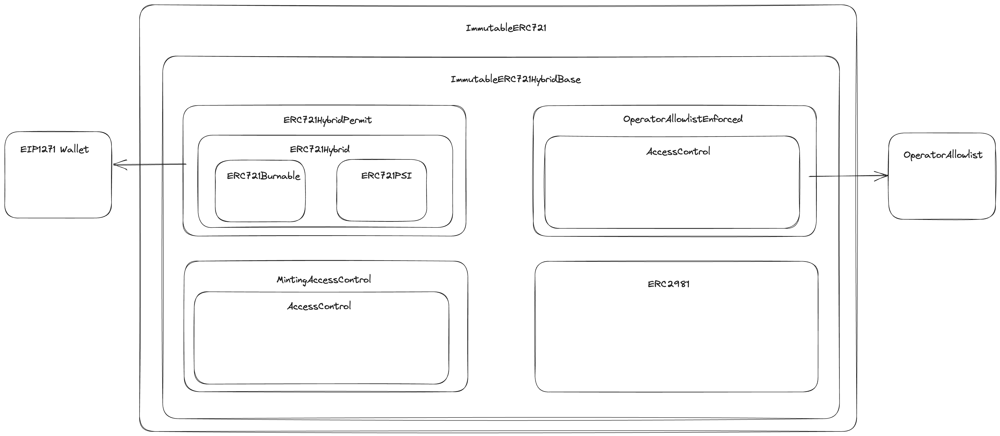

## Introduction

This document is a thread model for two preset erc721 token contracts built by Immutable.

This document encompasses information for all contracts under the [token](../contracts/token/) directory as well as the [allowlist](../contracts/allowlist/) directory.

## Context

The ERC721 presets built by Immutable were done with the requirements of cheaper onchain minting and flexible project management for games. Namely:

- Studios should be able to mint multiple tokens efficiently to multiple addresses.

- Studios should be able to to mint by token id out of order for metadata association.

- Minting should be restricted to addresses that were granted the `minter` role.

- Only allow operators should be able to modify and assign roles to addresses for administering the collection on chain.

- Contracts should not be upgradeable to prevent external developers from getting around royalty requirements.

## Design and Implementation

### ImmutableERC721

The ImmutableERC721 contract is a hybrid of Openzepplin implementation of [ERC721Burnable](https://github.com/OpenZeppelin/openzeppelin-contracts/blob/master/contracts/token/ERC721/extensions/ERC721Burnable.sol) and the [ERC721Psi](https://github.com/estarriolvetch/ERC721Psi/blob/main/contracts/ERC721Psi.sol) implementation. This is to give the studios flexibility on their minting strategies depending on their use cases.

The contract interface allows users to call methods to bulk mint multiple tokens either by ID or by quantity to multiple addresses.

The tokens are split into two different sections by a specific number `2^128`. This number was chosen arbitrarily. Studios have the option to override and replace it with their own threshold. Individual methods of the ERC721 and ERC721Psi implementations have all been overriden to call the accepted `tokenID`'s method implemented in their respective half of the contract. i.e any `tokenID` < `bulkMintThreadhold` will be calling the ERC721 methods and any `tokenID` >= `bulkMintThreadhold` will be calling the ERC721Psi implementations. The exceptions to this are methods involving supply balance which will sum the two halves together, as well as collection metadata information which remains consistent across all of the tokens. This also means the starting tokenId for the ERC721Psi collection is now 2^128 instead of 0.

[EIP4494](https://eips.ethereum.org/EIPS/eip-4494) Permit is added to allow for Gasless transactions from the token owners.

### ImmutableERC721MintByID

The ImmutableERC721MintByID contract is a subset of the ImmutableERC721 contract without the ERC721Psi features but retains features to allow bulk minting with in one transaction.

#### Modifications From Base Implementation

- Added a Bitmap to the Openzepplin ERC721 half to keep track of burns to prevent re-minting of burned tokens
- Added a new burning method to allow the contract to validate if the token being burned belongs to the address that is passed in
- Modified ERC721Psi `_safeMint` and `safeMint` methods to not call the overridden `_mint` methods but to call its own internally defined `_mint`
- Added a `_idMintTotalSupply` to help keep track of how many tokens have been minted and belong to a non-zero address for the `totalSupply()` method.
- Added Modifiers to `transfer` and `approve` related methods to enforce correct operator permissions.
- Added various bulk minting methods to allow the minting of multiple tokens to multiple addresses. These methods come with new structs.
- Added support for EIP4494 Permits. This feature comes with an additional nonce mapping that is needed to help keep track of the validity of permits. We decided to remove support for allowing `approved` contract addresses to validate and use permits as it does not fit any of the uses cases in Immutable's ecosystem, and there is no reliable method of getting all of the approved operators of a token.

## Attack Surfaces

The contract has no access to any funds. The risks will come from compromised keys that are responsible for managing the admin roles that control the collection. As well as permits and approves if an user was tricked into creating a permit that can be validated by a malicious eip1271 wallet giving them permissions to the user's token.

Potential Attacks:

- Compromised Admin Keys:
  - The compromised keys are able to assign the `MINTER_ROLE` to malicious parties and allow them to mint tokens to themselves without restriction
  - The compromised keys are able to update the `OperatorAllowList` to white list malicious contracts to be approved to operate on tokens within the collection
- Compromised Offchain auth:
  - Since EIP4494 combined with EIP1271 relies on off chain signatures that are not standard to the ethereum signature scheme, user auth info can be compromised and be used to create valid EIP1271 signatures.

## Tests

`npx hardhat test` will run all the related tests for the above mentioned repos. The test plan and cases are written in the test files describing the scenario is it testing for.

## Diagram

