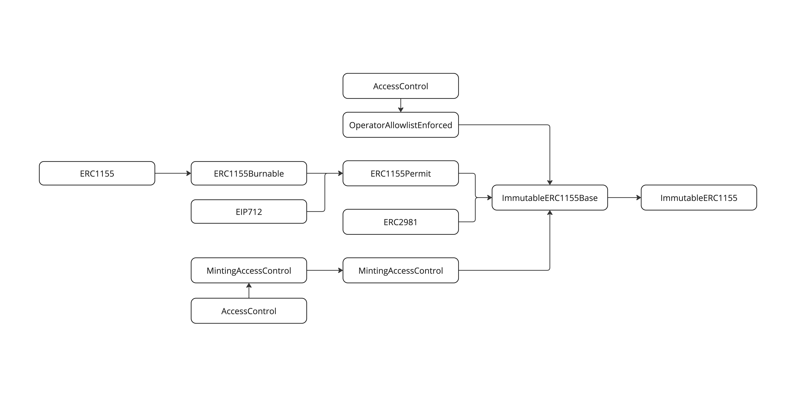

## Introduction

This document is a thread model for the preset ERC1155 token contracts built by Immutable.

Contracts covered under this model include:

- [ImmutableERC1155](../../contracts/token/erc1155/preset/ImmutableERC1155.sol)

as found in the commit hash `1ddb3dd` of the Immutable [contracts repository](https://github.com/immutable/contracts).

## Context

The ERC1155 presets built by Immutable were done with the requirements of supply tracking and permits.

- Clients should be able to track how many tokens of a specific token id in a collection is in circulation

- Clients should be able to create permits for unapproved wallets to operate on their behalf

- Minting should be restricted to addresses that were granted the `minter` role

- Only allowed operators should be able to modify and assign roles to addresses for administering the collection on chain

- Contracts should not be upgradeable to prevent external developers from getting around royalty requirements

## Design and Implementation

### ImmutableERC1155

`ImmutableERC1155` inherits the [ImmutableERC1155Base](../../contracts//token//erc1155//abstract/ImmutableERC1155Base.sol) contract and provides public functions for single and batch minting that are access controlled.

`ImmutableERC1155Base` inherits contracts:

- [OperatorAllowlistEnforced](../../contracts/allowlist/OperatorAllowlistEnforced.sol) - for setting an OperatorAllowlist that enables the restriction of approvals and transfers to allowlisted users
- [ERC1155Permit](../../contracts/token/erc1155/abstract/ERC1155Permit.sol) - an implementation of the ERC1155 Permit extension from Open Zeppelin allowing approvals to be made via EIP712 signatures, to allow for gasless transactions from the token owners
- [ERC2981](https://github.com/OpenZeppelin/openzeppelin-contracts/blob/master/contracts/token/common/ERC2981.sol) - an implementation of the NFT Royalty Standard for retrieving royalty payment information
- [MintingAccessControl](../../contracts/access/MintingAccessControl.sol) - implements access control for the `minter` role

The `ERC1155Permit` implementation inherits the OpenZeppelin [ERC1155Burnable](https://github.com/OpenZeppelin/openzeppelin-contracts/blob/master/contracts/token/ERC1155/extensions/ERC1155Burnable.sol) contract, which provides the public burn methods to be used by the client.

#### Modifications From Base Implementation

- Added total supply tracking for each token id. This will be managed via the pre-transfer hook called by mint, burn and transfer methods
- Added Permits to allow unapproved wallets to become approved without the owner spending gas.
- Override `uri` to return `baseURI` field to keep in standard with ImmutableERC721
- Added `baseURI` to replace `uri` to encourage the usage of `baseURI`

## Attack Surfaces

ERC1155 only has `setApproveForAll` as it's approval method. Meaning any flow that requires a 3rd party to operate on a set of tokens owned by another wallet will grant the third party access to all of that specific wallet's tokens. The third party needs to be entirely trustworthy. The owner needs to be diligent on revoking unrestricted access when not needed.

The contract has no access to any funds. Additional risks can come from compromised keys that are responsible for managing the admin roles that control the collection. As well as permits and approves if an user was tricked into creating a permit that can be validated by a malicious eip1271 wallet giving them permissions to the user's token.

Potential Attacks:

- Compromised Admin Keys:
  - The compromised keys are able to assign the `MINTER_ROLE` to malicious parties and allow them to mint tokens to themselves without restriction
  - The compromised keys are able to update the `OperatorAllowList` to white list malicious contracts to be approved to operate on tokens within the collection
- Compromised Offchain auth:
  - Since EIP4494 combined with EIP1271 relies on off chain signatures that are not standard to the ethereum signature scheme, user auth info can be compromised and be used to create valid EIP1271 signatures.

### Externally Visible Functions

An attacker could formulate an attack in which they send one or more transactions that execute one or more of these functions.

Functions that _change_ state:
| Name | Function Selector | Access Control |
| ------------------------------------------------------------- | ----------------- | --------------------- |
| burn(address,uint256,uint256) | f5298aca | None - permisionless |
| burnBatch(address,uint256[],uint256[]) | 6b20c454 | None - permisionless |
| grantMinterRole(address) | 3dd1eb61 | DEFAULT_ADMIN_ROLE |
| grantRole(bytes32,address) | 2f2ff15d | DEFAULT_ADMIN_ROLE |
| permit(address,address,bool,uint256,bytes) | d6b0b3f1 | None - permissionless |
| renounceRole(bytes32,address) | 36568abe | None - permissionless |
| revokeMinterRole(address) | 69e2f0fb | DEFAULT_ADMIN_ROLE |
| revokeRole(bytes32,address) | d547741f | DEFAULT_ADMIN_ROLE |
| safeBatchTransferFrom(address,address,uint256[],uint256[],bytes) | 2eb2c2d6 | None - permisionless |
| safeMint(address,uint256,uint256,bytes) | 5cfa9297 | MINTER_ROLE |
| safeMintBatch(address,uint256[],uint256[],bytes) | c39dfed8 | MINTER_ROLE |
| safeTransferFrom(address,address,uint256,uint256,bytes) | f242432a | None - permisionless |
| setApprovalForAll(address,bool) | a22cb465 | None - permisionless |
| setBaseURI(string) | 55f804b3 | DEFAULT_ADMIN_ROLE |
| setContractURI(string) | 938e3d7b | DEFAULT_ADMIN_ROLE |
| setDefaultRoyaltyReceiver(address,uint96) | 885e7a08 | DEFAULT_ADMIN_ROLE |
| setNFTRoyaltyReceiver(uint256,address,uint96) | 439aed34 | MINTER_ROLE |
| setNFTRoyaltyReceiverBatch(uint256[],address,uint96) | a7012816 | MINTER_ROLE |

Functions that _do not change_ state:
| Name | Function Selector | Access Control |
| ------------------------------------------------------------- | ----------------- | --------------------- |
| DEFAULT_ADMIN_ROLE() | a217fddf | None - permissionless |
| DOMAIN_SEPARATOR() | 3644e515 | None - permissionless |
| MINTER_ROLE() | d5391393 | None - permissionless |
| balanceOf(address,uint256) | 00fdd58e | None - permissionless |
| balanceOfBatch(address[],uint256[]) | 4e1273f4 | None - permissionless |
| baseURI() | 6c0360eb | None - permissionless |
| contractURI() | e8a3d485 | None - permissionless |
| eip712Domain() | 84b0196e | None - permissionless |
| exists(uint256) | 4f558e79 | None - permissionless |
| getAdmins() | 31ae450b | None - permissionless |
| getRoleAdmin(bytes32) | 248a9ca3 | None - permissionless |
| getRoleMember(bytes32,uint256) | 9010d07c | None - permissionless |
| getRoleMemberCount(bytes32) | ca15c873 | None - permissionless |
| hasRole(bytes32,address) | 91d14854 | None - permissionless |
| isApprovedForAll(address,address) | e985e9c5 | None - permissionless |
| nonces(address) | 7ecebe00 | None - permissionless |
| operatorAllowlist() | 29326f29 | None - permissionless |
| royaltyInfo(uint256,uint256) | 2a55205a | None - permissionless |
| supportsInterface(bytes4) | 01ffc9a7 | None - permissionless |
| totalSupply(uint256) | bd85b039 | None - permissionless |
| uri(uint256) | 0e89341c | None - permissionless |

## Tests

`forge test` will run all the related tests.

## Diagram

