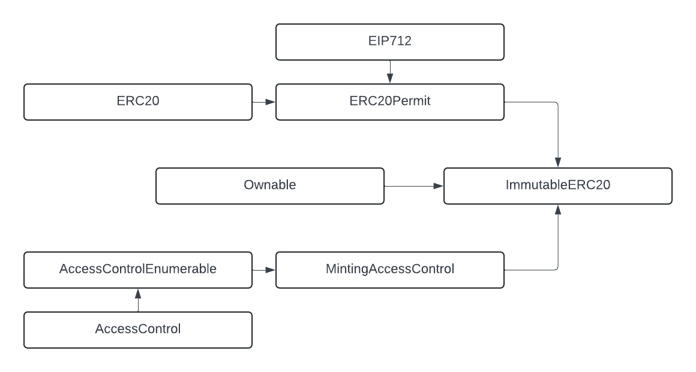

## Introduction
This document is a thread model for ImmutableERC20 token contracts built by Immutable.

Contracts covered under this model include:
[ImmutableERC20](../../contracts/token/erc20/preset/ImmutableERC20.sol)

## Context

The ERC20 token built by Immutable is meant to be used by game studios to release their own ERC20 tokens.

- Games should be able to define a max supply for the token

- The token contract must be owned by a non zero address at all times. Ownership can be transferred but not renounced.

- Minting should be restricted to addresses that were granted the `minter` role.

- Contract is not upgradeable at the moment. This can be extended if desired, but if the contract is to be deploye via the [Immutable Hub](https://hub.immutable.com/), it cannot be extended.

## Design and Implementation

### ImmutableERC20

ImmutableERC20 is a simple wrapper around the [ERC20 implementation from openzeppelin](https://github.com/OpenZeppelin/openzeppelin-contracts/blob/master/contracts/token/ERC20/ERC20.sol). It also extends [ERC20Permit](https://github.com/OpenZeppelin/openzeppelin-contracts/blob/master/contracts/token/ERC20/extensions/ERC20Permit.sol) allowing token holders to offload the approval costs to a third party who wish to operate on behalf of the holder. 

The contract defines an immutable `_maxSupply` value to track the maximum number of tokens allowed to be in circulation. This helps the token to derive value using scarcity.

The `renounceOwnership()` method from the `Ownable` extension has been overridden to prevent the contract from being ownerless. This is to help Immutable Hub to link tokens based of their owners. 

`Owner` and `DEFAULT_ADMIN_ROLE` will share the same key at depolyment, but the `Ownership` can be transferred.

## Attack Surfaces

The contract has no access to any funds. It only contains slight modifications to the Openzeppelin ERC20 implementation which have been audited and implemented throughout the web3 space. The risks will come from compromised keys that are responsible for managing the admin roles that control the token minting permissions.

Potential Attacks:
- Compromised Admin Keys:
    - The compromised keys are able to assign the `MINTER_ROLE` to malicious parties and allow them to mint tokens to themselves without restriction.
    - The compromised keys are able to give ownership of the contract over to malicious party.
    - The compromised keys are able revoke the `MINTER_ROLE` from verified parties and limit token minting activity 

### Externally Visible Functions
An attacker could formulate an attack in which they send one or more transactions that execute one or more of these functions.

Functions that *change* state:
| Name                                                          | Function Selector | Access Control        |
| ------------------------------------------------------------- | ----------------- | --------------------- |
| mint(address,uint256)                                         | 0x40c10f19        | MINTER_ROLE           |
| burn(address,uint256)                                         | 0x9dc29fac        | None - permissionless |
| renounceOwnership()                                           | 0x715018a6        | OnlyOwner             |
| transfer(address,uint256)                                     | 0xa9059cbb        | None - permissionless |
| approve(address,uint256)                                      | 0x095ea7b3        | None - permissionless |
| increaseAllowance(address,uint256)                            | 0x39509351        | None - permissionless |
| decreaseAllowance(address,uint256)                            | 0xa457c2d7        | None - permissionless |
| transferFrom(address,address,uint256)                         | 0x23b872dd        | None - permissionless |
| permit(address,address,uint256,uint256,uint8,bytes32,bytes32) | 0xd505accf        | None - permissionless |
| grantMinterRole(address)                                      | 0x3dd1eb61        | DEFAULT_ADMIN_ROLE    |
| grantRole(bytes32,address)                                    | 0x2f2ff15d        | DEFAULT_ADMIN_ROLE    |
| renounceRole(bytes32,address)                                 | 0x36568abe        | None - permissionless |
| revokeMinterRole(address)                                     | 0x69e2f0fb        | DEFAULT_ADMIN_ROLE    |
| revokeRole(bytes32,address)                                   | 0xd547741f        | DEFAULT_ADMIN_ROLE    |
| transferOwnership(address)                                    | 0xf2fde38b        | OnlyOwner             |

Functions that *do not change* state:
| Name                                                          | Function Selector | Access Control        |
| ------------------------------------------------------------- | ----------------- | --------------------- |
| DEFAULT_ADMIN_ROLE()                                          | 0xa217fddf        | None - permissionless |
| DOMAIN_SEPARATOR()                                            | 0x3644e515        | None - permissionless |
| MINTER_ROLE()                                                 | 0xd5391393        | None - permissionless |
| allowance(address,address)                                    | 0xdd62ed3e        | None - permissionless |
| balanceOf(address)                                            | 0x70a08231        | None - permissionless |
| decimals()                                                    | 0x313ce567        | None - permissionless |
| eip712Domain()                                                | 0x84b0196e        | None - permissionless |
| getAdmins()                                                   | 0x31ae450b        | None - permissionless |
| getRoleAdmin(bytes32)                                         | 0x248a9ca3        | None - permissionless |
| getRoleMember(bytes32,uint256)                                | 0x9010d07c        | None - permissionless |
| getRoleMemberCount(bytes32)                                   | 0xca15c873        | None - permissionless |
| hasRole(bytes32,address)                                      | 0x91d14854        | None - permissionless |
| maxSupply()                                                   | 0xd5abeb01        | None - permissionless |
| name()                                                        | 0x06fdde03        | None - permissionless |
| nonces(address)                                               | 0x7ecebe00        | None - permissionless |
| owner()                                                       | 0x8da5cb5b        | None - permissionless |
| supportsInterface(bytes4)                                     | 0x01ffc9a7        | None - permissionless |
| symbol()                                                      | 0x95d89b41        | None - permissionless |
| totalSupply()                                                 | 0x18160ddd        | None - permissionless |

## Tests
`forge test` will run all the related tests for the above mentioned repos. The test plan and cases are written in the test files describing the scenario is it testing for. The test plan can be seen [here](../../test/token/erc20/preset/README.md)

## Diagram 

