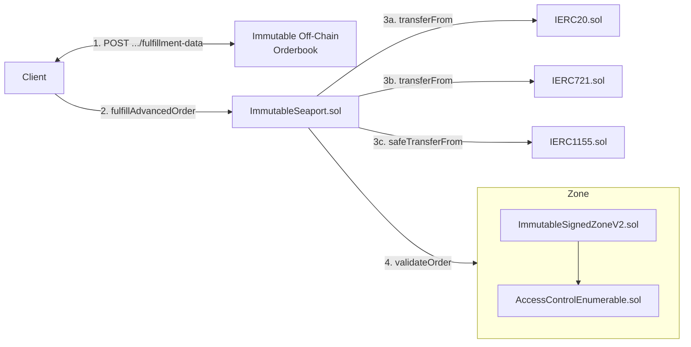

# Immutable Signed Zone (v2) Threat Model

## Introduction

This threat model document for the [Immutable Signed Zone (v2)](../../contracts/trading/seaport/zones/immutable-signed-zone/v2/README.md) contract has been created in preparation for internal audit.

## Rationale

Immutable operates a global off-chain orderbook across Immutable zkEVM chains and relies on the Seaport protocol for on-chain settlement. The orderbook primarily intends to:

* Centralise liquidity
* Enforce payment of fees (protocol, royalty, marketplace)

The [Immutable Signed Zone (v2)](../../contracts/trading/seaport/zones/immutable-signed-zone/v2/README.md) is an implementation of [SIP-7: Server-Signed Orders [TBD]](). The reasons Immutable has chosen this solution is:

* It requires orders to be known by the orderbook prior to fulfilment
* It allows the orderbook to refuse fulfilment of an order at its discretion (e.g. for gasless cancellations, or compromised collections)
* It allows for arbitrary logic to be defined off-chain and enforced on-chain (e.g. to enforce fees)

## Threat Model Scope

The threat model is limited to the following Solidity files at GitHash [TBD]:

* [ImmutableSignedZoneV2.sol [TBD]]()
* [SIP5EventsAndErrors.sol [TBD]]()
* [SIP5Interface [TBD]]()
* [SIP6EventsAndErrors [TBD]]()
* [SIP6Interface [TBD]]()
* [SIP7EventsAndErrors [TBD]]()
* [SIP7Interface [TBD]]()

## Background

Seaport: [Documentation](https://github.com/ProjectOpenSea/seaport/blob/20b84b94755ab4fcdd88735d5f8f1f578e07924a/docs/SeaportDocumentation.md) for v1.6 but relevant for v1.5 which Immutable's Seaport fork is based on.

SIP-7: [Documentation [TBD]]().

## Architecture

### Top Level Architecture

The trading system on the Immutable platform is shown in the diagram below.



The sequence of events is as follows:

1. The client makes a HTTP `POST .../fulfillment-data` request to the Immutable Orderbook, which will construct and sign an `extraData` payload to return to the client
2. The client calls `fulfillAdvancedOrder` or `fulfillAvailableAdavancedOrders` on `ImmutableSeaport.sol` to fulfill an order
3. `ImmutableSeaport.sol` executes the fufilment by transferring items between parties
4. `ImmutableSeaport.sol` calls `validateOrder` on `ImmutableSignedZoneV2.sol`, passing it the fulfilment execution details as well as the `extraData` parameter
   1. `ImmutableSignedZoneV2.sol` validates the fulfilment execution details using the `extraData` payload, reverting if expectations are not met

### Immutable Signed Zone (v2) Design

Immutable Signed Zone (v2) is an implementation of the SIP-7 specification, supporting substandards 3, 4 and 6.

This section explains the security relevant aspects of the Immutable Signed Zone (v2) contract beyond the scope of the SIP-7 specification.

#### Roles

The Immutable Signed Zone (v2) supports the following roles:

* Default Admin
  * Creates and removes other administrators
  * First admin is assigned to the `address owner` param on the `constructor`
  * Call the following configuration functions:
    * `addSigner`
    * `removeSigner`
    * `updateAPIEndpoint`
    * `updateDocumentationURI`

### Other Information

This section provides links to test plans and test code.

#### Test Plans and Test Code

The test plan is available here: [Test Plan for Immutable Signed Zone (v2)](../../test/trading/seaport/zones/immutable-signed-zone/v2/README.md). The test code is contained in the same directory at the test plan.

#### Continuous Integration

Each time a commit is pushed to a pull request, the [continuous integration loop executes](https://github.com/immutable/contracts/actions).

#### Building, Testing, Coverage and Static Code Analysis

For instructions on building the code, running tests, coverage, and Slither, see the [BUILD.md](https://github.com/immutable/contracts/blob/main/BUILD.md).

## Attack Surfaces

The following sections list attack surfaces evaluated as part of this threat modelling exercise.

### Externally Visible Functions

An attacker could formulate an attack in which they send one or more transactions that execute one or more of these functions.

#### ImmutableSignedZoneV2

This section describes the externally visible functions available in ImmutableSignedZoneV2. The list of functions and their function selectors was determined by the following command. The additional information was obtained by reviewing the code.

```
forge inspect ImmutableSignedZoneV2 --pretty methods
```

Functions that *change* state:

| Name                             | Function Selector | Access Control  |
| -------------------------------- | ----------------- | --------------- |
| `addSigner(address)`             | eb12d61e          | `DEFAULT_ADMIN` |
| `grantRole(bytes32,address)`     | 2f2ff15d          | Role admin      |
| `removeSigner(address)`          | 0e316ab7          | `DEFAULT_ADMIN` |
| `renounceRole(bytes32,address)`  | 36568abe          | `msg.sender`    |
| `revokeRole(bytes32,address)`    | d547741f          | Role admin      |
| `updateAPIEndpoint(string)`      | 297234d7          | `DEFAULT_ADMIN` |
| `updateDocumentationURI(string)` | 0a904f08          | `DEFAULT_ADMIN` |

Functions that *do not change* state:

| Name                                                                                                                                                           | Function Selector |
| -------------------------------------------------------------------------------------------------------------------------------------------------------------- | ----------------- |
| `DEFAULT_ADMIN_ROLE()`                                                                                                                                         | a217fddf          |
| `getRoleAdmin(bytes32)`                                                                                                                                        | 248a9ca3          |
| `getRoleMember(bytes32,uint256)`                                                                                                                               | 9010d07c          |
| `getRoleMemberCount(bytes32)`                                                                                                                                  | ca15c873          |
| `getSeaportMetadata()`                                                                                                                                         | 2e778efc          |
| `hasRole(bytes32,address)`                                                                                                                                     | 91d14854          |
| `sip7Information()`                                                                                                                                            | d600940e          |
| `supportsInterface(bytes4)`                                                                                                                                    | 01ffc9a7          |
| `validateOrder((bytes32,address,address,(uint8,address,uint256,uint256)[],(uint8,address,uint256,uint256,address)[],bytes,bytes32[],uint256,uint256,bytes32))` | 17b1f942          |

### Admin Roles

### Signers

### Upgrade and Storage Slots

`ImmutableSignedZoneV2.sol` is not upgradeable, and hence not subject to an upgrade attack.

## Perceived Attackers

### TBD

## Attack Mitigation

### TBD

## Conclusion


