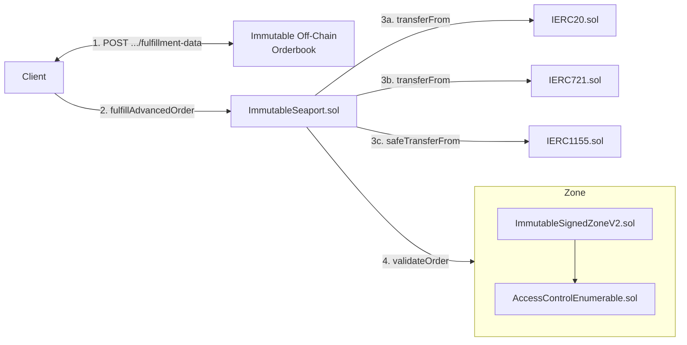

# Immutable Signed Zone (v2) Threat Model

## Introduction

This threat model document for the [Immutable Signed Zone (v2)](../../contracts/trading/seaport/zones/immutable-signed-zone/v2/README.md) contract has been created in preparation for internal audit.

## Rationale

Immutable operates a global off-chain orderbook across Immutable zkEVM chains and relies on the Seaport protocol for on-chain settlement. The orderbook primarily intends to:

* Centralise liquidity
* Enforce payment of fees (protocol, royalty, marketplace)

The [Immutable Signed Zone (v2)](../../contracts/trading/seaport/zones/immutable-signed-zone/v2/README.md) is an implementation of [SIP-7: Server-Signed Orders](https://github.com/ProjectOpenSea/SIPs/blob/main/SIPS/sip-7.md). The reasons Immutable has chosen this solution is:

* It requires orders to be known by the orderbook prior to fulfilment
* It allows the orderbook to refuse fulfilment of an order at its discretion (e.g. for gasless cancellations, or compromised collections)
* It allows for arbitrary logic to be defined off-chain and enforced on-chain (e.g. to enforce fees)

## Threat Model Scope

The threat model is limited to the following Solidity files at GitHash [`f6dffe08db1ff2daead3abe0c22b44d792ce5e59`](https://github.com/immutable/contracts/blob/f6dffe08db1ff2daead3abe0c22b44d792ce5e59/contracts/trading/seaport/zones/immutable-signed-zone/v2):

* [ImmutableSignedZoneV2.sol](https://github.com/immutable/contracts/blob/f6dffe08db1ff2daead3abe0c22b44d792ce5e59/contracts/trading/seaport/zones/immutable-signed-zone/v2/ImmutableSignedZoneV2.sol)
* [ZoneAccessControl.sol](https://github.com/immutable/contracts/blob/f6dffe08db1ff2daead3abe0c22b44d792ce5e59/contracts/trading/seaport/zones/immutable-signed-zone/v2/ZoneAccessControl.sol)
* [ZoneAccessControlEventsAndErrors.sol](https://github.com/immutable/contracts/blob/f6dffe08db1ff2daead3abe0c22b44d792ce5e59/contracts/trading/seaport/zones/immutable-signed-zone/v2/interfaces/ZoneAccessControlEventsAndErrors.sol)
* [SIP5EventsAndErrors.sol](https://github.com/immutable/contracts/blob/f6dffe08db1ff2daead3abe0c22b44d792ce5e59/contracts/trading/seaport/zones/immutable-signed-zone/v2/interfaces/SIP5EventsAndErrors.sol)
* [SIP5Interface](https://github.com/immutable/contracts/blob/f6dffe08db1ff2daead3abe0c22b44d792ce5e59/contracts/trading/seaport/zones/immutable-signed-zone/v2/interfaces/SIP5Interface.sol)
* [SIP6EventsAndErrors](https://github.com/immutable/contracts/blob/f6dffe08db1ff2daead3abe0c22b44d792ce5e59/contracts/trading/seaport/zones/immutable-signed-zone/v2/interfaces/SIP6EventsAndErrors.sol)
* [SIP6Interface](https://github.com/immutable/contracts/blob/f6dffe08db1ff2daead3abe0c22b44d792ce5e59/contracts/trading/seaport/zones/immutable-signed-zone/v2/interfaces/SIP6Interface.sol)
* [SIP7EventsAndErrors](https://github.com/immutable/contracts/blob/f6dffe08db1ff2daead3abe0c22b44d792ce5e59/contracts/trading/seaport/zones/immutable-signed-zone/v2/interfaces/SIP7EventsAndErrors.sol)
* [SIP7Interface](https://github.com/immutable/contracts/blob/f6dffe08db1ff2daead3abe0c22b44d792ce5e59/contracts/trading/seaport/zones/immutable-signed-zone/v2/interfaces/SIP7Interface.sol)

## Background

Seaport: [Documentation](https://github.com/ProjectOpenSea/seaport/blob/20b84b94755ab4fcdd88735d5f8f1f578e07924a/docs/SeaportDocumentation.md) for v1.6 but relevant for v1.5 which Immutable's Seaport fork is based on.

SIP-7: [Documentation](https://github.com/ProjectOpenSea/SIPs/blob/main/SIPS/sip-7.md).

## Architecture

### Top Level Architecture

The trading system on the Immutable platform is shown in the diagram below.



The sequence of events is as follows:

1. The client makes a HTTP `POST .../fulfillment-data` request to the Immutable Orderbook, which will construct and sign an `extraData` payload to return to the client
2. The client calls `fulfillAdvancedOrder` or `fulfillAvailableAdavancedOrders` on `ImmutableSeaport.sol` to fulfill an order
3. `ImmutableSeaport.sol` executes the fufilment by transferring items between parties
4. `ImmutableSeaport.sol` calls `validateOrder` on `ImmutableSignedZoneV2.sol`, passing it the fulfilment execution details as well as the `extraData` parameter
   1. `ImmutableSignedZoneV2.sol` validates the fulfilment execution details using the `extraData` payload, reverting if expectations are not met

### Immutable Signed Zone (v2) Design

Immutable Signed Zone (v2) is an implementation of the SIP-7 specification, supporting substandards 3, 4 and 6.

This section explains the security relevant aspects of the Immutable Signed Zone (v2) contract beyond the scope of the SIP-7 specification.

#### Roles

The Immutable Signed Zone (v2) supports the following roles:

* Default Admin
  * Creates and removes other administrators
  * First admin is assigned to the `address owner` param on the `constructor`
  * Call the following configuration functions:
    * `addSigner`
    * `removeSigner`
    * `updateAPIEndpoint`
    * `updateDocumentationURI`

### Other Information

This section provides links to test plans and test code.

#### Test Plans and Test Code

The test plan is available here: [Test Plan for Immutable Signed Zone (v2)](../../test/trading/seaport/zones/immutable-signed-zone/v2/README.md). The test code is contained in the same directory at the test plan.

#### Continuous Integration

Each time a commit is pushed to a pull request, the [continuous integration loop executes](https://github.com/immutable/contracts/actions).

#### Building, Testing, Coverage and Static Code Analysis

For instructions on building the code, running tests, coverage, and Slither, see the [BUILD.md](https://github.com/immutable/contracts/blob/main/BUILD.md).

## Attack Surfaces

The following sections list attack surfaces evaluated as part of this threat modelling exercise.

### Externally Visible Functions

An attacker could formulate an attack in which they send one or more transactions that execute one or more of these functions.

#### ImmutableSignedZoneV2

This section describes the externally visible functions available in ImmutableSignedZoneV2. The list of functions and their function selectors was determined by the following command. The additional information was obtained by reviewing the code.

```
forge inspect ImmutableSignedZoneV2 --pretty methods
```

Functions that *change* state:

| Name                             | Function Selector | Access Control      |
| -------------------------------- | ----------------- | ------------------- |
| `addSigner(address)`             | eb12d61e          | `ZONE_MANAGER_ROLE` |
| `grantRole(bytes32,address)`     | 2f2ff15d          | Role admin          |
| `removeSigner(address)`          | 0e316ab7          | `ZONE_MANAGER_ROLE` |
| `renounceRole(bytes32,address)`  | 36568abe          | `msg.sender`        |
| `revokeRole(bytes32,address)`    | d547741f          | Role admin          |
| `updateAPIEndpoint(string)`      | 297234d7          | `ZONE_MANAGER_ROLE` |
| `updateDocumentationURI(string)` | 0a904f08          | `ZONE_MANAGER_ROLE` |

Functions that *do not change* state:

| Name                                                                                                                                                           | Function Selector |
| -------------------------------------------------------------------------------------------------------------------------------------------------------------- | ----------------- |
| `DEFAULT_ADMIN_ROLE()`                                                                                                                                         | a217fddf          |
| `ZONE_MANAGER_ROLE()`                                                                                                                                          | c6e95ae7          |
| `getRoleAdmin(bytes32)`                                                                                                                                        | 248a9ca3          |
| `getRoleMember(bytes32,uint256)`                                                                                                                               | 9010d07c          |
| `getRoleMemberCount(bytes32)`                                                                                                                                  | ca15c873          |
| `getSeaportMetadata()`                                                                                                                                         | 2e778efc          |
| `hasRole(bytes32,address)`                                                                                                                                     | 91d14854          |
| `sip7Information()`                                                                                                                                            | d600940e          |
| `supportsInterface(bytes4)`                                                                                                                                    | 01ffc9a7          |
| `validateOrder((bytes32,address,address,(uint8,address,uint256,uint256)[],(uint8,address,uint256,uint256,address)[],bytes,bytes32[],uint256,uint256,bytes32))` | 17b1f942          |

### Admin Roles

Accounts with administrative privileges could be used by attackers to facilitate attacks. This section analyses what each role can do.

#### Accounts with `DEFAULT_ADMIN` role on ImmutableSignedZoneV2 contract

This role is granted to the `owner` specified in the `constructor` of the contract. Accounts with the `DEFAULT_ADMIN` account can:

* Grant administrator roles to any account, including the `DEFAULT_ADMIN` role
* Revoke administrator roles from any account, including the `DEFAULT_ADMIN` role
  * The `DEFAULT_ADMIN` role cannot be revoked from an account if it the only account with the `DEFAULT_ADMIN` role
* Renounce the `DEFAULT_ADMIN` role for itself, unless it is the only account with the `DEFAULT_ADMIN` role

Exploiting this attack surface requires compromising an account with `DEFAULT_ADMIN` role.

#### Accounts with `ZONE_MANAGER` role on ImmutableSignedZoneV2 contract

An account with `ZONE_MANAGER` role can:

* Update API endpoint and documentation URI (no impact to Immutable system as these values are not utilised)
* Add and remove SIP-7 signers, letting them control the result of order validation
* Renounce the `ZONE_MANAGER` role for itself

Exploiting this attack surface requires compromising an account with `ZONE_MANAGER` role.

### SIP-7 Signers on the ImmutableSignedZoneV2 contract

Accounts added as SIP-7 signers could be used by attackers to facilitate attacks. Accounts added as an SIP-7 signer can:

* Control the result of order validation

Exploiting this attack surface requires compromising an account added as an SIP-7 signer.

### Upgrade and Storage Slots

`ImmutableSignedZoneV2.sol` is not upgradeable, and hence not subject to an upgrade attack.

## Perceived Attackers

This section lists the attackers that could attack the trading system.

It is assumed that all attackers have access to all documentation and source code of all systems related to the Immutable zkEVM, irrespective of whether the information resides in a public or private GitHub repository, email, Slack, Confluence, or any other information system.

### Spear Phisher

This attacker compromises accounts of people by using Spear Phishing attacks. For example they send a malicious PDF file to a user, which the user opens, the PDF file then installs malware on the user's computer. At this point, it is assumed that the Spear Phisher Attacker can detect all key strokes, mouse clicks, see all information retrieved, see any file in the user's file system, and execute any program on the user's computer.

### Server Powner

This attacker is able to compromise any server computer, *Powerfully Owning* the computer. For instance, they can compromise an Immutable server responsible for signing SIP-7 data. They can read values from the computer's RAM and access key material for an SIP-7 signer.

### Immutable zkEVM Block Proposer

An operator of an Immutable zkEVM Block Proposer could, within narrow limits, alter the block timestamp of the block they produce. If this block included transactions related to this zone, it could allow an expired signature to evaluated as valid.

### Insider

This attacker works for a company helping operate the Immutable zkEVM. This attacker could be being bribed or blackmailed. They can access the keys that they as an individual employee have access to. For instance, they might be one of the signers of the multi-signer administrative role.

## Attack Mitigation

This section outlines possible attacks against the attack surfaces by the attackers, and how those attacks are mitigated.

### `DEFAULT_ADMIN` Role Account Compromise

**Detection:** Monitoring role change events.

The mitigation is to assume that the role will be operated by multi-signature addresses such that an attacker would need to compromise multiple signers simultaneously. As such, even if some keys are compromised due to the Spear Phishing Attacker or the Insider Attacker, the administrative actions will not be able to be executed as a threshold number of keys will not be available.

### `ZONE_MANAGER` Role Account Compromise

**Detection:** Monitoring SIP-7 signer events.

The mitigation is to assume that the role will be operated by multi-signature addresses such that an attacker would need to compromise multiple signers simultaneously. As such, even if some keys are compromised due to the Spear Phishing Attacker or the Insider Attacker, the administrative actions will not be able to be executed as a threshold number of keys will not be available.

### SIP-7 Signer Account Compromise

**Detection:** Monitoring order fulfilment events against SIP-7 data signed by Immutable's systems.

The Spear Phisher or Server Powner Attackers can compromise Immutable's systems to extract SIP-7 signer key material. Due to the nature of the trading system requiring high frequency signing of SIP-7 data, signer key material is stored on the server. The mitigation to this is to rotate SIP-7 signers on a regular cadence.

### `block.timestamp` Manipulation

This attack performed by an operator of an Immutable zkEVM Block Proposer, could allow an attacker to alter the result of order validation, only where it concerns SIP-7 signature expiry within a narrow time range. This attack is unlikely to be meaningful for an attacker.

## Conclusion

This threat model has presented the architecture of the system, determined attack surfaces, and identified possible attackers and their capabilities. It has walked through each attack surface and based on the attackers, determined how the attacks are mitigated.
