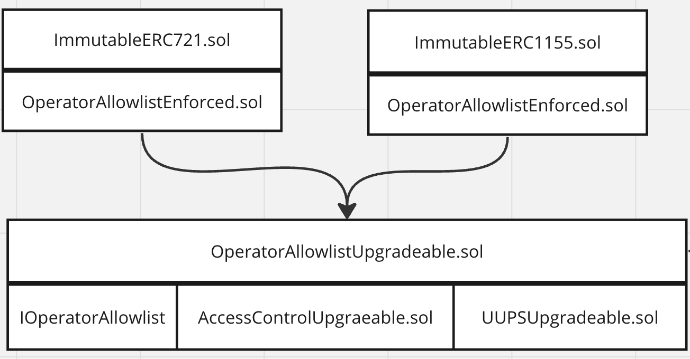

# Operator Allowlist

The OperatorAllowlist contracts provide functionality for enabling token contract approvals and transfers to be restricted to allowlisted users. This enables on-chain royalties to be enforced by restricting a contract's transfers to Immutable's version of the Seaport contract that honors royalties.

More developer documentation is available on Immutable's doc site: [https://docs.immutable.com/docs/zkEVM/products/minting/royalties/allowlist-spec](https://docs.immutable.com/docs/zkEVM/products/minting/royalties/allowlist-spec)

# Status

Contract audits and threat models:

| Description               | Date             |Version Audited  | Link to Report |
|---------------------------|------------------|-----------------|----------------|
| Internal audit            | Feb 16, 2024     | [c3dc85](https://github.com/immutable/contracts/blob/c3dc85984ced2e8e75576ba5ef84f2141d810bb4/contracts/allowlist/)  | [202402-internal-audit-operator-allow-list](../../audits/allowlist/202402-internal-audit-operator-allow-list.pdf) |

## OperatorAllowlistUpgradeable
ERC 1967 Proxy that the implementation contract sits behind:

| Location                  | Date             | Version Deployed | Address |
|---------------------------|------------------|------------------|---------|
| Immutable zkEVM Testnet   | Jan 22, 2024     | [3dac7b](https://github.com/OpenZeppelin/openzeppelin-contracts/blob/3dac7bbed7b4c0dbf504180c33e8ed8e350b93eb/contracts/proxy/ERC1967/ERC1967Proxy.sol)     | [0x6b969FD89dE634d8DE3271EbE97734FEFfcd58eE](https://explorer.testnet.immutable.com/address/0x6b969FD89dE634d8DE3271EbE97734FEFfcd58eE)  |
| Immutable zkEVM Mainnet   | Jan 22, 2024 | [3dac7b](https://github.com/OpenZeppelin/openzeppelin-contracts/blob/3dac7bbed7b4c0dbf504180c33e8ed8e350b93eb/contracts/proxy/ERC1967/ERC1967Proxy.sol)      | [0x5F5EBa8133f68ea22D712b0926e2803E78D89221](https://explorer.immutable.com/address/0x5F5EBa8133f68ea22D712b0926e2803E78D89221)       |

OperatorAllowlistUpgradeable implementation contract:

| Location                  | Date             | Version Deployed | Address |
|---------------------------|------------------|------------------|---------|
| Immutable zkEVM Testnet   | Jan 22, 2024     | [929cbb](https://github.com/immutable/contracts/blob/929cbbb9bfabdc854b2c21b1c7a8c7ab396f6676/contracts/allowlist/OperatorAllowlistUpgradeable.sol)     | [0x700dA7D7845310c9B032d04878eD73908b23d805](https://explorer.testnet.immutable.com/address/0x700dA7D7845310c9B032d04878eD73908b23d805)  |
| Immutable zkEVM Mainnet   | Jan 22, 2024 | [929cbb](https://github.com/immutable/contracts/blob/929cbbb9bfabdc854b2c21b1c7a8c7ab396f6676/contracts/allowlist/OperatorAllowlistUpgradeable.sol)    | [0xe0337f80Fa41Cd5BBa154F15AD0708b542bAd17a](https://explorer.immutable.com/address/0xe0337f80Fa41Cd5BBa154F15AD0708b542bAd17a)       |

# Architecture

The architecture of the Operator Allowlist system is shown below. 

## OperatorAllowlistEnforced

ERC 721 and ERC 1155 contracts extend the `OperatorAllowlistEnforced` contract. The `OperatorAllowlistEnforced` contract includes the Solidity modifiers `validateApproval` and `validateTransfer`. Token contracts should ensure that these modifiers are called whenever an approval or transfer takes place. The modifiers call a function `isAllowlisted` in the `OperatorAllowlistUpgradeable` contract. Doing this enables the restriction of approvals and transfers to allowlisted users.

## IOperatorAllowlist

`IOperatorAllowlist` is an interface which provides the API used by `OperatorAllowlistEnforced` to communicate with `OperatorAllowlistUpgradeable`. 

## OperatorAllowlistUpgradeable

`OperatorAllowlistUpgradeable` is a contract implementation of an allow list registry. It stores addresses and wallet proxy bytecode hashes which are approved to be a part of ERC 721 adn ERC 1155 token approvals and transfers. 

The `OperatorAllowlistUpgradeable` contract is a Universal Upgradeable Proxy Standard (UUPS) upgrade contract, and has access control features, and implements the `IOperatorAllowlist` interface. `OperatorAllowlistEnforced` calls `OperatorAllowlistUpgradeable` based on functions defined in the `IOperatorAllowlist` interface. 

The contract holds sits behind an `ERC1967Proxy` contract. Thus, the state of the contract is stored at the address of the `ERC1967Proxy` contract, and the implementation logic is stored at the address of the `OperatorAllowlistUpgradeable` contract.

## IWalletProxy.sol

The `IWalletProxy` is the interface provided by the Passport Wallet contract proxy to allow the `OperatorAllowlistUpgradeable` contract to determine the implementation address of the wallet. 

