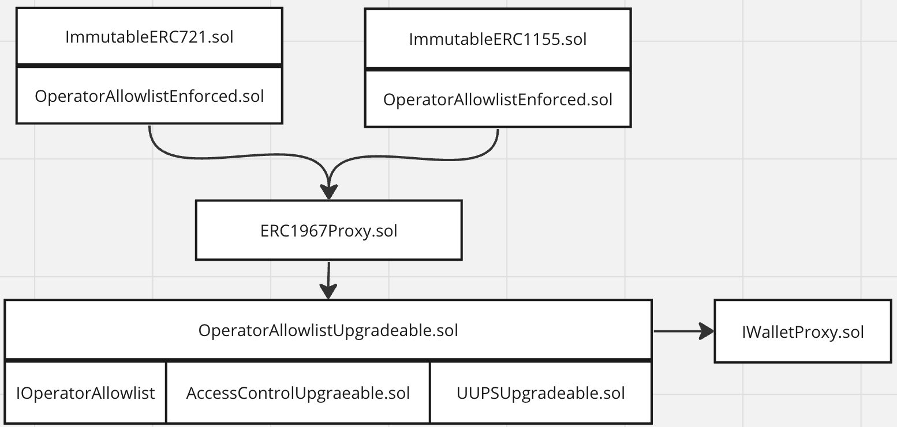

# Operator Allowlist

The OperatorAllowlist contracts provide functionality for enabling token contract approvals and transfers to be restricted to allowlisted users. This enables on-chain royalties to be enforced by restricting a contract's transfers to Immutable's version of the Seaport contract that honors royalties.

More developer documentation is available on Immutable's doc site: [https://docs.immutable.com/docs/zkEVM/products/minting/royalties/allowlist-spec](https://docs.immutable.com/docs/zkEVM/products/minting/royalties/allowlist-spec)

# Status

Contract audits and threat models:

| Description               | Date             |Version Audited  | Link to Report |
|---------------------------|------------------|-----------------|----------------|
| No audits or threat models | -                | -               | -              |

OperatorAllowlistUpgradeable Deployments: Note: the addresses are for the ERC 1967 Proxy that the implementation contract sits behind.

| Location                  | Date             | Version Deployed | Address |
|---------------------------|------------------|------------------|---------|
| Immutable zkEVM Testnet   | Jan 22, 2024     | [929cbb](https://github.com/immutable/contracts/blob/929cbbb9bfabdc854b2c21b1c7a8c7ab396f6676/contracts/allowlist/OperatorAllowlistUpgradeable.sol)     | [0x6b969FD89dE634d8DE3271EbE97734FEFfcd58eE](https://explorer.testnet.immutable.com/address/0x6b969FD89dE634d8DE3271EbE97734FEFfcd58eE)  |
| Immutable zkEVM Mainnet   | Jan 22, 2024 | [929cbb](https://github.com/immutable/contracts/blob/929cbbb9bfabdc854b2c21b1c7a8c7ab396f6676/contracts/allowlist/OperatorAllowlistUpgradeable.sol)    | [0x5F5EBa8133f68ea22D712b0926e2803E78D89221](https://explorer.immutable.com/address/0x5F5EBa8133f68ea22D712b0926e2803E78D89221?tab=contract)       |

# Architecture

The architecture of the Operator Allowlist system is shown below. 

## OperatorAllowlistEnforced

OperatorAllowlistEnforced is an abstract contract that token contracts can inherit in order to set the address of the OperatorAllowlist registry that it will interface with, so that the token contract may enable the restriction of approvals and transfers to allowlisted users.

ERC 721 and ERC 1155 contracts extend the OperatorAllowlistEnforced contract. The OperatorAllowlistEnforced contract includes the Solidity modifiers validateApproval and validateTransfer. Token contracts should ensure that these modifiers are called whenever an approval or transfer takes place. The modifiers call a function isAllowlisted in the OperatorAllowlistUpgradeable contract. Doing this enables the restriction of approvals and transfers to allowlisted users.

## OperatorAllowlistUpgradeable

OperatorAllowlistUpgradeable is a contract implementation of an Allowlist registry, storing addresses and bytecode which are allowed to be approved operators and execute transfers of interfacing token contracts (e.g. ERC721/ERC1155). The registry will be a deployed contract that tokens may interface with and point to. The OperatorAllowlistUpgradeable contract is a Universal Upgradeable Proxy Standard (UUPS) upgrade contract, and has access control features, and implements the IOperatorAllowlist interface. OperatorAllowlistEnforced calls OperatorAllowlistUpgradeable based on functions defined in the IOperatorAllowlist interface.

## IOperatorAllowlist

IOperatorAllowlist is an interface required for interacting with an OperatorAllowlist compliant contract.

