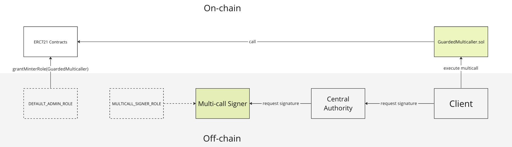

# GuardedMulticaller

The GuardedMulticaller contract provides functionality to call multiple functions across different target contracts, the function signatures are validated to ensure they are permitted. Currently one of the use cases we have is in the Primary Sales flow, the GuardedMulticaller executes `transferFrom()` and `safeMint()` functions on different target contracts in a single transaction. 

# Status

Contract audits and threat models:

| Description               | Date             |Version Audited  | Link to Report |
|---------------------------|------------------|-----------------|----------------|
| External audit            | Sept 26, 2023     | [605c3e2](https://github.com/immutable/multicaller-contracts/tree/605c3e2956c914a77181baba85dfca9bde8c3829)  | [202309-external-audit-multicaller](../../audits/multicall/202309-external-audit-multicaller.pdf) |

# Architecture

The architecture of the GuardedMulticaller system is shown below. 

