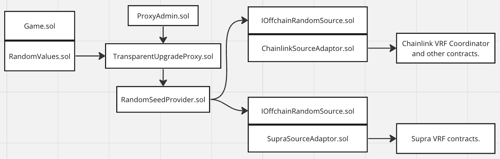
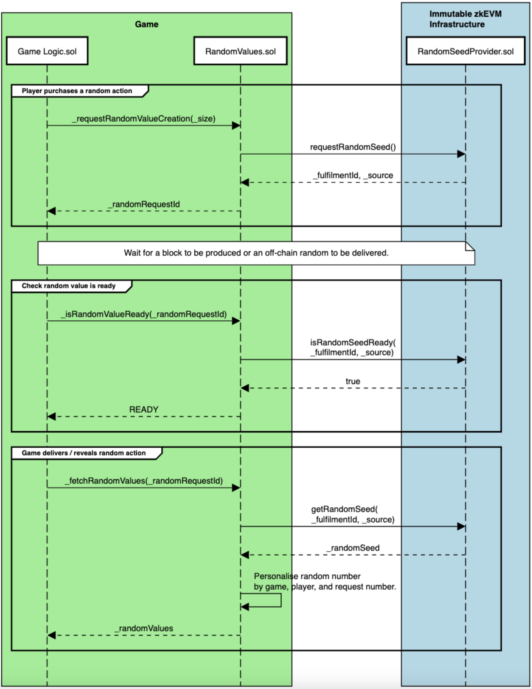

# Random Number Generation

This directory contains contracts that provide random number generation capability using on-chain and off-chain sources. 

The reasons for using these contracts are that:

* Enables you to leverage a random number generation system designed by Immutable's cryptographers.
* Allows you to build your game against an API that won't change.
* The quality of the random numbers generated will improve as new capabilities are added to the platform. That is, the migration from ```block.hash``` to ```block.prevrandao``` when the BFT fork occurs will be seamless.
* For off-chain randomness, allows you to leverage the random number provider that Immutable has agreements with.

# Status

Contract threat models and audits:

| Description               | Date             |Version Audited  | Link to Report |
|---------------------------|------------------|-----------------|----------------|
| Not audited and no threat model              | -                | -               | -              |

## RandomSeedProvider

The RandomSeedProvider contract has not yet been deployed.

| Location                  | Date             | Version Deployed | Address |
|---------------------------|------------------|------------------|---------|
| Immutable zkEVM Testnet   | Not deployed     | -       | - |
| Immutable zkEVM Mainnet   | Not deployed     | -       | - |

## Architecture

The Random Number Generation system on the immutable platform is shown in the diagram below.



Game contracts extend ```RandomValues.sol```. This contract interacts with the ```RandomSeedProvider.sol``` contract to request and retreive random seed values. 

There is one ```RandomSeedProvider.sol``` contract deployed per chain. Each game has its own instance of ```RandomValues.sol``` as this contract is integrated directly into the game contract. 

The ```RandomSeedProvider.sol``` operates behind a transparent proxy, ```ERC1967Proxy.sol```, with the upgrade
logic included in the ```UUPSUpgradeable.sol``` contract that ```RandomSeedProvider.sol``` extends. Using an upgradeable pattern allows the random manager contract to be upgraded to extend its feature set and resolve issues. 

The ```RandomSeedProvider.sol``` contract can be configured to use an off-chain random number source. This source is accessed via the ```IOffchainRandomSource.sol``` interface. To allow the flexibility to switch between off-chain random sources, there is an adaptor contract between the offchain random source contract and the random seed provider.

The architecture diagram shows a ChainLink VRF source and a Supra VRF source. This is purely to show the possibility of integrating with one off-chain service and then, at a later point choosing to switch to an alternative off-chain source. At present, there is no agreement to use any specific off-chain source.


## Process of Requesting a Random Number

The process for requesting a random number is shown below. Players do actions requiring a random number or a set of random numbers. They purchase, or commit to the random value(s), which is later revealed. 



The steps are:

* The game contract calls ```_requestRandomValueCreation```.
The ```_requestRandomValueCreation``` returns a value ```_randomRequestId```. This value is supplied later to fetch the random value once it has been generated. The function ```_requestRandomValueCreation``` executes a call to the ```RandomSeedProvider``` contract requesting a seed value be produced.
* The game contract calls ```_isRandomValueReady```, passing in the ```_randomRequestId```. This returns ```READY``` if the value is ready to be returned.
* The game contract calls ```_fetchRandomValues```, passing in the ```_randomRequestId```. The random seed is returned to the ```RandomValues``` contract, which then customises the value prior returning it to the game.


# Notes

Sequence diagram source [here](https://sequencediagram.org/index.html#initialData=C4S2BsFMAICUEMB2ATA9gW2gOQK7oEaQBO0A4pIsfKKogFB0AO8RoAxiM4sAOZGo5G0AMTgQPABa8ikCtABU80vHSRFTFu05Jg0AETLV0ADKoeINgDoAzqnB7o8a2RWQNrC9u76EKDADV4cBxIaxs7Byc4fzoKZHctLmkBIVFxKXxgmEUASXR0HGB4TJgALwBrAFF-AFkAHUQcxAAzIidgIhw2YBwZdWYPDiSfJDR0AGVZZAAFfgA3EGRicPtHZ1ga2JQGPhToafB4AE9iaEZetgknUMdoNr9MeG6QWjpDSABaAD5YfwAuaAAfRkAEcQtZgL4xoEsgBhGTUF6IAAUgOsIFKkAAlHRft8NgDQeDIaMMJNIMhkTjfgAeD4fAlA5o4cDNEDgVTcHLIAA0QNsFzc7zpDP+QPuY1gkDBoWA3K28ToiFQwBgqDmp3ePIJAHV4GBoM1UCR4NBMqg2OVoMBUGaYIx+MguhToMbHIhXc1mh9LvqPRKMNbbYRoEsxBqZMhLDt+IJoLCJJBLXdSZg5kEQtAQM4Ecgjm9XPixYDs1CAhnIFL4HnUQH0FKZRDudT-PiagDS6nycgqzWGoDmaz2Zy5bz+QIiGxsbj-CLGR0QgXVHOxbBKgBBAAiAE0FTG9u9Q5Bw8RnAB6O6QDVBHOpxzPV7vIsAgeQYCXMvoGHg2uphvE5sZzbAEeDfT9u2RftBzZDkKFHPk0QnKcWzndtxS7KYgJ+MVplPWggmzGA62gRA8EIEgGnwI5oB4Vw+UYQ4TiIPlRkvRtdFIghliXSAVxfOtv1CPcGBEoA).