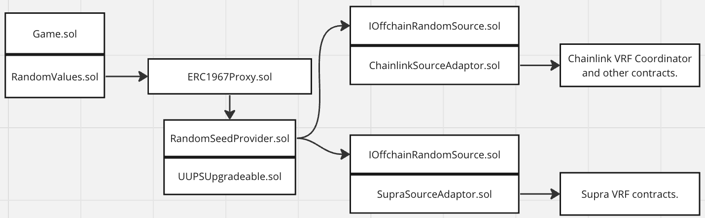

# Random Number Generation

This directory contains contracts that provide on-chain random number generation.

## Architecture

The Random Number Generation system on the immutable platform is shown in the diagram below.



Game contracts extend ```RandomValues.sol```. This contract interacts with the ```RandomManager.sol``` contract to request and retreive random numbers. 

There is one ```RandomManager.sol``` contract deployed per chain. Each game has its own instance of ```RandomValues.sol``` as this contract is integrated directly into the game contract. 

The ```RandomManager.sol``` operates behind a transparent proxy, ```TransparentUpgradeProxy.sol``` that is controlled by ```ProxyAdmin.sol```. Using an upgradeable pattern allows the random manager contract to be upgraded to extend its feature set and resolve issues. 

The ```RandomManager.sol``` contract can be configured to use an off-chain random number source. This source is accessed via the ```IOffchainRandomSource.sol``` interface. To allow the flexibility to switch off-chain random sources, there is an adaptor contract between the offchain random source contract and the random manager. 

Initially, no offchain random source will be used. As such, the ```RandomSourceAdaptor.sol``` contract has not been implemented at this time.


## Process of Requesting a Random Number

The process for requesting a random number is shown below. Players do actions requiring a random number. They purchase, or commit to the random value, which is later revealed. 


The steps are:

* The game contract calls ```requestRandomValueCreation```, passing in a security level. Values of 1 or 2 are OK for small value random numbers, and higher values such as 3 or 4 are better for high value random numbers. The security level relates to how many blocks must pass or off-chain random numbers need to be submitted prior to returning the random value.
* The ```requestRandomValueCreation``` returns a value ```_randomRequestId```. This value is supplied later to fetch the random value once it has been generated.

* TODO should have a "is it ready step" in the sequence.

* The game contract calls ```fetchRandom```, passing in the ```_randomRequestId```. The random seed is returned to the RandomValue.sol, which then customises the value prior returning it to the game.


Diagram source here: https://sequencediagram.org/index.html#initialData=C4S2BsFMAICUEMB2ATA9gW2gOQK7oEaQBO0A4pIsfKKogFB0AO8RoAxiM4sNAESnx0kAHQBnVOF7R4osoMhMW7Tkh68EKDADV44HCPGTps2FsWsQHLmo1p0AWSTwA5sTESpMuPYbOiqHEZoAAVweABPYmhGHCI2AAsZSFl4aCIkO2k2GnoBIQBaAD5TAC40yABHfVFgW21dfQBhIkhqEFoACgAdRBwQbgAmAFYANmgAfVFINliwcIAZSAA3SHAASjpTIth7Mpaq5NqMjG7e-uBhscnp2eAF5dWN0wAefPydsvH0zXRYSurgABJZB0PKQV7vLSfb52P4HGrAugUEF0RCoYAwVArEhggA0HwA6vAwNAAGaoEipfDgVBsADW0GAqGghGi-mQODYkGQ0Ap0kQvNJpPyCWJAphGEZzNZyFWIGx3OEvn8gTkQmgsvA8uIsgA9OUVrpZBLMPBsu1cvJtlCyZBgAk6uhTn1BqMJia4QDgU8tNtdtBXEcfgBlSDc53nS7u46-f6Hb2bLQQj7RkNhkFbYo24I62i6EBTNIx6C9AhRHpMgPyXHRMKRIg1jLleHAHqlwhEJVg5M2r4xnR6BTIhgjuhAA