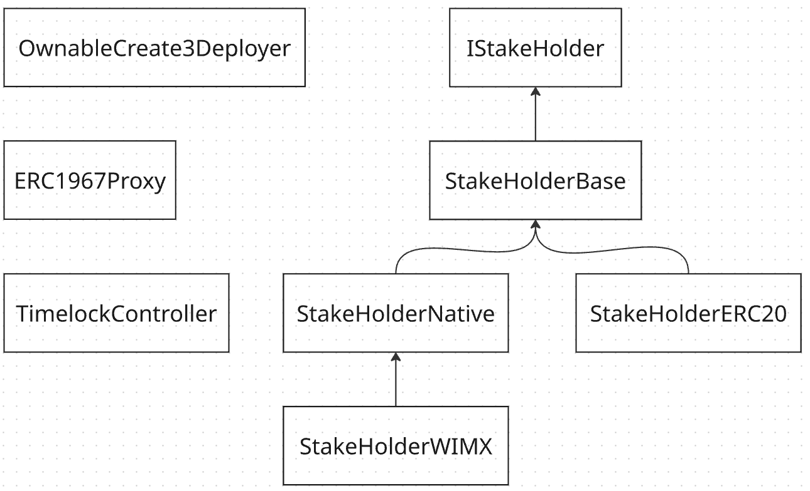

# Staking

The Immutable zkEVM staking system allows any account (EOA or contract) to stake any amount of a token at any time. An account can remove all or some of their stake at any time. The contract has the facility to distribute rewards to stakers.

The staking contracts are upgradeable and operate via a proxy contract. They use the [Universal Upgradeable Proxy Standard (UUPS)](https://eips.ethereum.org/EIPS/eip-1822) upgrade pattern, whether the authorisation and access control for upgrade resides within the application contract (the staking contract). 

The system consists of a set of contracts show in the diagram below.

`IStakeHolder.sol` is the interface that all staking implementations comply with.

`StakeHolderBase.sol` is the abstract base contract that all staking implementation use.

`StakeHolderERC20.sol` allows an ERC20 token to be used as the staking currency.

`StakeHolderNative.sol` uses the native token, IMX, to be used as the staking currency.

`ERC1967Proxy.sol` is a proxy contract. All calls to StakeHolder contracts go via the ERC1967Proxy contract.

`TimelockController.sol` can be used with the staking contracts to provide a one week delay between upgrade or other admin changes are proposed and when they are executed. See below for information on how to configure the time lock controller.

`OwnableCreate3Deployer.sol` ensures contracts are deployed to the same addresses across chains. The use of this contract is optional. See [deployment scripts](../../script/staking/README.md) for more information.

## Immutable Contract Addresses

StakeHolderERC20.sol configured with IMX as the staking token:

| Environment/Network      | Deployment Address | Commit Hash |
|--------------------------|--------------------|-------------|
| Immutable zkEVM Testnet  | Not deployed yet   |   -|
| Immutable zkEVM Mainnet  | Not deployed yet   |   -|

# Status

Contract threat models and audits:

| Description               | Date             |Version Audited  | Link to Report |
|---------------------------|------------------|-----------------|----------------|
| Threat model              | Oct 21, 2024     | [`fd982abc49884af41e05f18349b13edc9eefbc1e`](https://github.com/immutable/contracts/blob/fd982abc49884af41e05f18349b13edc9eefbc1e/contracts/staking/README.md) | [202410-threat-model-stake-holder.md](../../audits/staking/202410-threat-model-stake-holder.md)              |

# Deployment

See [deployment scripts](../../script/staking/README.md).

# Usage

For StakeHolderERC20, the ERC20 staking token must be specified when the contract is being initialised. The token can not be changed.

To stake, any account should call `stake(uint256 _amount)`. For the native IMX variant, the amount to be staked must be passed in as the msg.value.

To unstake, the account that previously staked should call, `unstake(uint256 _amountToUnstake)`.

Accounts that have DISTRIBUTE_ROLE that wish to distribute rewards should call, `distributeRewards(AccountAmount[] calldata _recipientsAndAmounts)`. The `AccountAmount` structure consists of recipient address and amount to distribute pairs. Distributions can only be made to accounts that have previously or are currently staking. For the native IMX variant, the amount to be distributed must be passed in as msg.value and must equal to the sum of the amounts specified in the `_recipientsAndAmounts` array.

The `stakers` array needs to be analysed to determine which accounts have staked and how much. The following functions provide access to this data structure:

* `getNumStakers() returns (uint256 _len)`: Return the length of the stakers array. This is the number of accounts that ever staked using the contract.
* `getStakers(uint256 _startOffset, uint256 _numberToReturn) returns (address[] memory _stakers)`: Return all or a subset of the stakers array. The stakers array never changes order. As such, off-chain systems can cache previous results.
* `getBalance(address _account) returns (uint256 _balance)`: Return the amount staked by an account.
* `hasStaked(address _account) returns (bool _everStaked)`: Returns true if the account has ever staked.

# Administration Notes

The `StakeHolderBase` contract is `AccessControlEnumerableUpgradeable`. The `StakeHolderERC20` and `StakeHolderNative` contracts are `UUPSUpgradeable`. Only accounts with `UPGRADE_ROLE` are authorised to upgrade the contract.

## Upgrade Concept

The `upgradeStorage` function should be updated each new contract version. It should do the following:

* Check the value returned by `version`. This is the version of the code and associated storage format from the previous version prior to the upgrade. Three alternatives are possible:
  * The value is less than the new version: Upgrade as per the bullet points below.
  * The value is higher than the new version: This probably indicates that an attempt to upgrade the contract has mistakenly downgraded the contract to a previous version. The function should revert.
  * The value is the same as the newt version: Someone (an attacker) has called the `upgradeStorage` function after the code has been upgraded. The function should revert.
* Based on the old code version and storage format indicated by the `version`, update the storage variables. Typically, upgrades only involve code changes, and require no storage variable changes. However, in some circumstances storage variables should also be updated.
* Update the `version` storage variable to indicate the new code version.

## Time Delay Upgrade and Admin

A staking systems may wish to delay upgrade actions and the granting of additional administrative access. To do this, the only account with UPGRADE_ROLE and DEFAULT_ADMIN_ROLE roles should be an instance of Open Zeppelin's [TimelockController](https://github.com/OpenZeppelin/openzeppelin-contracts/blob/master/contracts/governance/TimelockController.sol). This ensures any upgrade proposals or proposals to add more accounts with `DEFAULT_ADMIN_ROLE`, `UPGRADE_ROLE` or `DISTRIBUTE_ROLE` must go through a time delay before being actioned. The account with `DEFAULT_ADMIN_ROLE` could choose to renounce this role to ensure the `TimelockController` can not be bypassed at a later date by having a compromised account with  `DEFAULT_ADMIN_ROLE` adding addtional accounts with `UPGRADE_ROLE`.

## Preventing Upgrade

A staking system could choose to have no account with DEFAULT_ADMIN_ROLE to to prevent additional accounts being granted UPGRADE_ROLE role. The system could have no acccounts with UPGRADE_ROLE, thus preventing upgrade. The system could configure this from start-up by passing in `address(0)` as the `roleAdmin` and `upgradeAdmin` to the constructor. Alternative, the `revokeRole` function can be used to revoke the roles from accounts.
