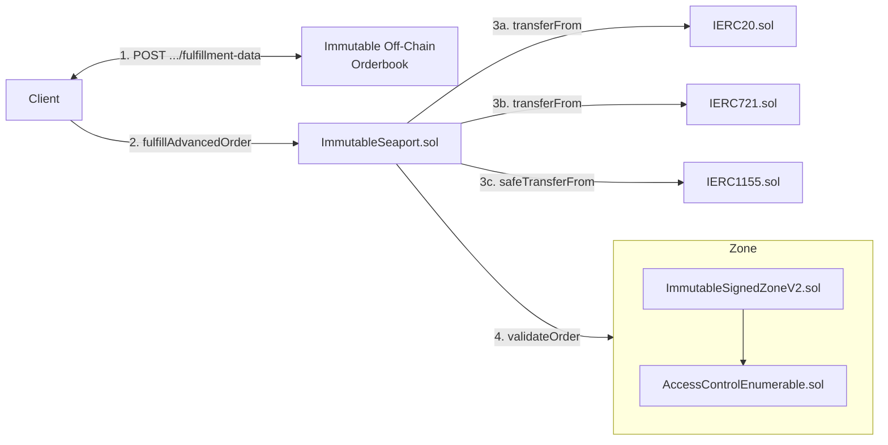

# Immutable Signed Zone (v2)

The Immutable Signed Zone contract is a [Seaport Zone](https://docs.opensea.io/docs/seaport-hooks#zone-hooks) that implements [SIP-7 (Interface for Server-Signed Orders)](https://github.com/ProjectOpenSea/SIPs/blob/main/SIPS/sip-7.md) with support for [substandards](https://github.com/ProjectOpenSea/SIPs/blob/main/SIPS/sip-7.md#substandards) 3, 4 and 6.

This zone is used by Immutable to enable:

* Enforcement of protocol, royalty and ecosystem fees
* Off-chain order cancellation

# Status

Contract threat models and audits:

| Description                     | Date | Version Audited | Link to Report |
| ------------------------------- | ---- | --------------- | -------------- |
| Not audited and no threat model | -    | -               | -              |

## ImmutableSignedZoneV2

| Location                | Date         | Version Deployed | Address |
| ----------------------- | ------------ | ---------------- | ------- |
| Immutable zkEVM Testnet | Not deployed | -                | -       |
| Immutable zkEVM Mainnet | Not deployed | -                | -       |

## Architecture

The trading system on the Immutable platform is shown in the diagram below.

The sequence of events is as follows:

1. The client makes a HTTP `POST .../fulfillment-data` request to the Immutable Orderbook, which will construct and sign an `extraData` payload to return to the client
2. The client calls `fulfillAdvancedOrder` or `fulfillAvailableAdavancedOrders` on `ImmutableSeaport.sol` to fulfill an order
3. `ImmutableSeaport.sol` executes the fufilment by transferring items between parties
4. `ImmutableSeaport.sol` calls `validateOrder` on `ImmutableSignedZoneV2.sol`, passing it the fulfilment execution details as well as the `extraData` parameter
5. `ImmutableSignedZoneV2.sol` validates the fulfilment execution details using the `extraData` payload, reverting if expectations are not met

## Differences compared to ImmutableSignedZone (v1)

The contract was developed based on ImmutableSignedZone, with the addition of:
 - SIP7 substandard 6 support
 - Role based access control to be role based

### ZoneAccessControl

The contract now uses a finer grained access control with role based access with the `ZoneAccessControl` interface, rather than the `Ownable` interface in the v1 contract. A seperate `zoneManager` roles is used to manage signers and an admin role used to control roles.

### Support of SIP7 substandard 6

The V2 contract now supports substandard-6 of the SIP7 specification, found here (https://github.com/immutable/platform-services/pull/12775). A server side signed order can adhere to substandard 3 + 4 (full fulfillment) or substandard 6 + 4 (partial fulfillment).
