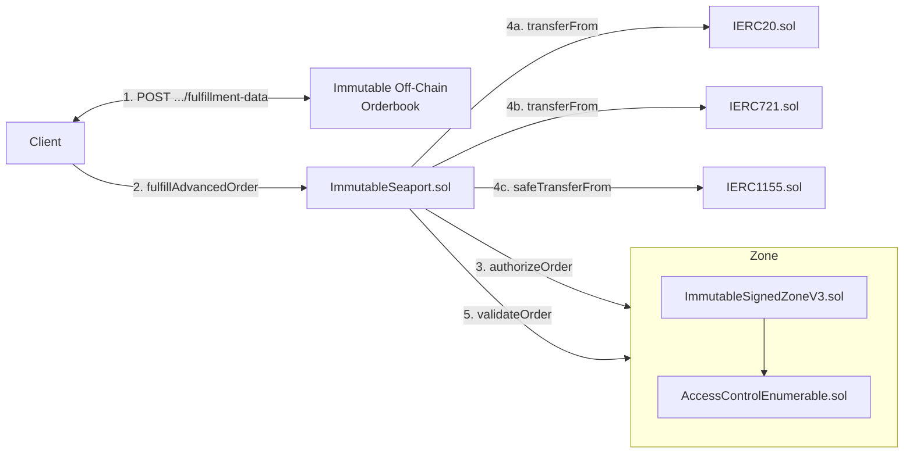

# Immutable Signed Zone (v3)

The Immutable Signed Zone contract is a [Seaport Zone](https://docs.opensea.io/docs/seaport-hooks#zone-hooks) that implements [SIP-7 (Interface for Server-Signed Orders)](https://github.com/ProjectOpenSea/SIPs/blob/main/SIPS/sip-7.md) with support for [substandards](https://github.com/ProjectOpenSea/SIPs/blob/main/SIPS/sip-7.md#substandards) 1, 3, 4, 6 and 7.

This zone is used by Immutable to enable:

* Enforcement of protocol, royalty and ecosystem fees
* Off-chain order cancellation

# Status

Contract threat models and audits:

| Description    | Date       | Version Audited | Link to Report                                                                                                                      |
| -------------- | ---------- | --------------- | ----------------------------------------------------------------------------------------------------------------------------------- |
| Threat Model   | 2024-04-15 | V2              | [202404-threat-model-immutable-signed-zone-v2.md](../../../../../../audits/trading/202404-threat-model-immutable-signed-zone-v2.md)       |
| Internal Audit | 2024-05-02 | V2              | [202405-internal-audit-immutable-signed-zone-v2.pdf](../../../../../../audits/trading/202405-internal-audit-immutable-signed-zone-v2.pdf) |

## ImmutableSignedZoneV2

| Location                | Date         | Version Deployed | Address |
| ----------------------- | ------------ | ---------------- | ------- |
| Immutable zkEVM Testnet | Not deployed | -                | -       |
| Immutable zkEVM Mainnet | Not deployed | -                | -       |

## Architecture

The trading system on the Immutable platform is shown in the diagram below.

The sequence of events is as follows:

1. The client makes a HTTP `POST .../fulfillment-data` request to the Immutable Orderbook, which will construct and sign an `extraData` payload to return to the client
2. The client calls `fulfillAdvancedOrder` or `fulfillAvailableAdvancedOrders` on `ImmutableSeaport.sol` to fulfill an order
3. `ImmutableSeaport.sol` executes the fufilment by transferring items between parties
4. `ImmutableSeaport.sol` calls `authorizeOrder` on `ImmutableSignedZoneV3.sol`, passing it the fulfilment execution details as well as the `extraData` parameter
5. `ImmutableSignedZoneV3.sol` authorizes the fulfilment execution details using the `extraData` payload, reverting if expectations are not met
6. `ImmutableSeaport.sol` calls `validateOrder` on `ImmutableSignedZoneV3.sol`, passing it the fulfilment execution details as well as the `extraData` parameter
7. `ImmutableSignedZoneV3.sol` validates the fulfilment execution details using the `extraData` payload, reverting if expectations are not met

## Differences compared to ImmutableSignedZone (v2)

The contract was developed based on ImmutableSignedZoneV2, with the addition of:
 - Support for the Seaport 1.6 Zone interface `authorizeOrder` function
 - SIP-7 Substandard 1
 - SIP-7 Substandard 7
